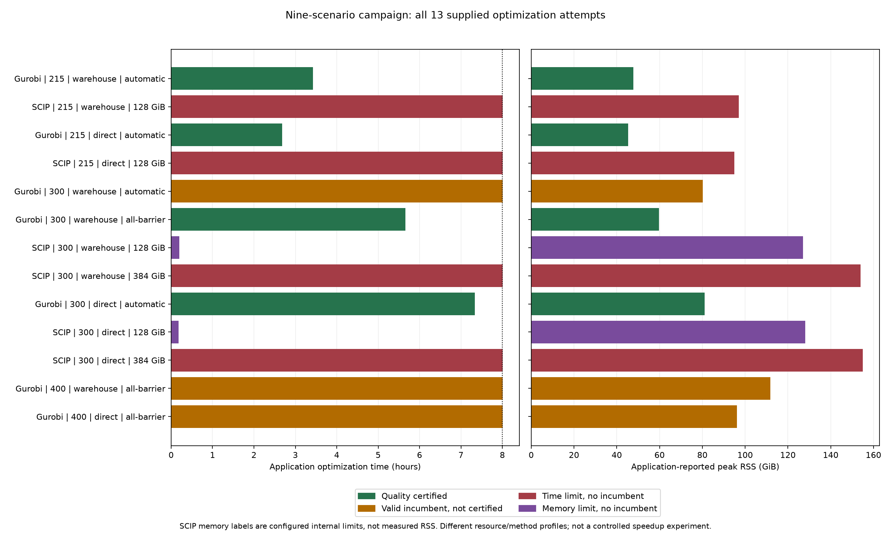

<!-- Generated by scripts/build_manuscript_comparison.py; do not edit. -->

| Hubs / arcs / profile | Outcome | Capacity gap (%) | Economic gap (%) | Optimization (h) | RSS (GiB) |
|:--|:--|--:|--:|--:|--:|
| 215 / W / A | Certified | 0.0255 | 0.0166 | 3.424 | 47.67 |
| 215 / D / A | Certified | 0.8691 | 0.0137 | 2.682 | 45.29 |
| 300 / W / A | Uncertified | 0.1755 | 50.5203 | 8.009 | 80.22 |
| 300 / W / B | Certified | 0.2478 | 0.0831 | 5.662 | 59.77 |
| 300 / D / A | Certified | 1.2874 | 0.0677 | 7.336 | 80.99 |
| 400 / W / B | Uncertified | 100.0000 | — | 8.007 | 111.76 |
| 400 / D / B | Uncertified | 0.0643 | 99.9998 | 8.011 | 96.23 |

: Gurobi attempts. W: warehouse-only; D: direct-enabled; A: historical
automatic profile; B: all-barrier. Gaps belong to the respective passes.
An em dash denotes an unexecuted economic pass. All seven incumbents
passed their original independent validation. RSS is the application
process high-water mark, not the configured memory limit. {#tbl-gurobi-comparison}

| Hubs / arcs | Internal limit (MB) | Termination | Optimization (h) | RSS (GiB) |
|:--|--:|:--|--:|--:|
| 215 / W | 131072 | Time limit | 8.004 | 97.12 |
| 215 / D | 131072 | Time limit | 8.006 | 94.98 |
| 300 / W | 131072 | Memory limit | 0.198 | 127.06 |
| 300 / W | 393216 | Time limit | 8.006 | 153.98 |
| 300 / D | 131072 | Memory limit | 0.184 | 128.18 |
| 300 / D | 393216 | Time limit | 8.006 | 155.06 |

: SCIP/SoPlex attempts. Every attempt terminated without an incumbent;
economic cost, achieved service and a finite gap are therefore unavailable.
The 393216 MB repeats also used larger nodes and allocations.
Times include the application optimization region. {#tbl-scip-comparison}

{#fig-solver-comparison}

| Hubs / arcs / profile | Economic cost (billion input-currency units) | Final static score (million) | Final reception overflow (million t) |
|:--|--:|--:|--:|
| 215 / W / A | 399.489 | 382.949 | 70.437 |
| 215 / D / A | 353.989 | 338.528 | 0.003 |
| 300 / W / B | 396.099 | 321.520 | 38.834 |
| 300 / D / A | 354.889 | 306.125 | 0.015 |

: Conditional outputs of quality-certified Gurobi attempts. The static
score sums scenario-weighted stock exceedances over warehouse-periods;
it is not installed capacity. Reception overflow is already a period
quantity. Costs exclude artificial penalties and do not identify a
causal benefit of direct arcs under differing inherited limits. {#tbl-economic-observations}

| Hubs / arcs / profile | Service (s) | Capacity (s) | Economics (s) |
|:--|--:|--:|--:|
| 215 / W / A | 482.6 | 4774.6 | 7059.0 |
| 215 / D / A | 413.2 | 3041.3 | 6192.0 |
| 300 / W / A | 1077.9 | 13161.8 | 14578.8 |
| 300 / W / B | 1120.1 | 11491.5 | 7754.2 |
| 300 / D / A | 829.0 | 8350.6 | 17210.9 |
| 400 / W / B | 2133.4 | 26670.2 | — |
| 400 / D / B | 3136.6 | 20536.0 | 5137.3 |

: Native Gurobi pass runtimes. These are not primary optimization times
for an entire job, and their sum need not equal the enclosing application
timer. Time-limited passes can slightly exceed the nominal remaining
budget while returning control. {#tbl-stage-times}
