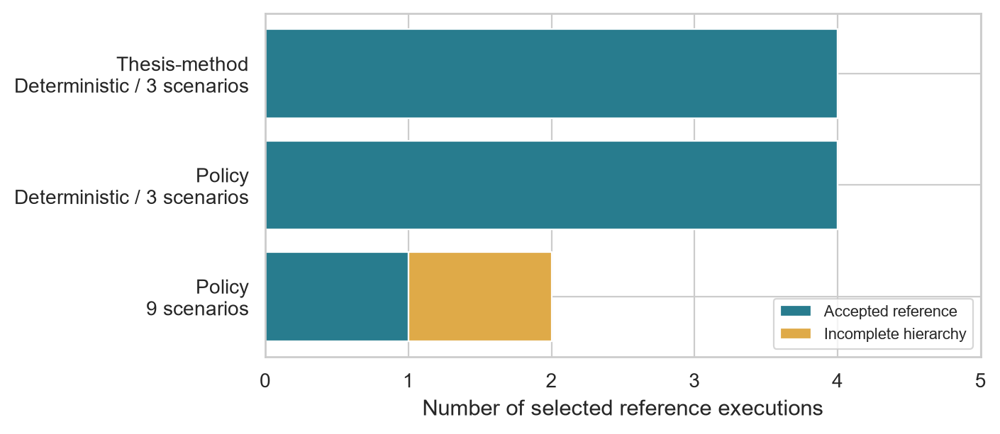
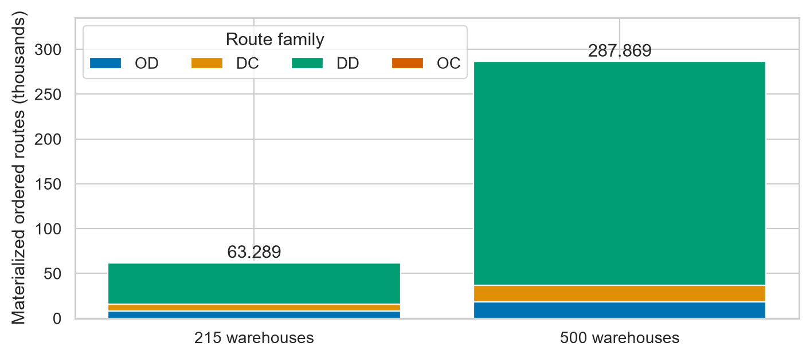
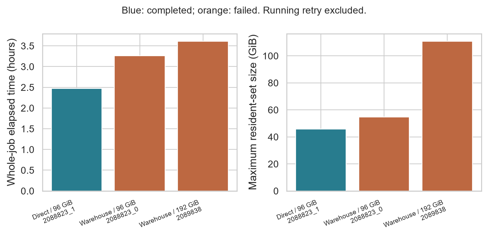
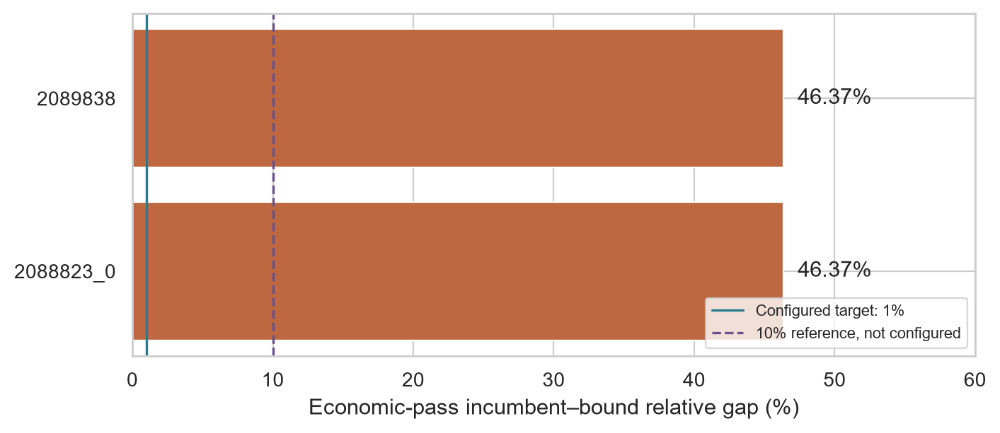
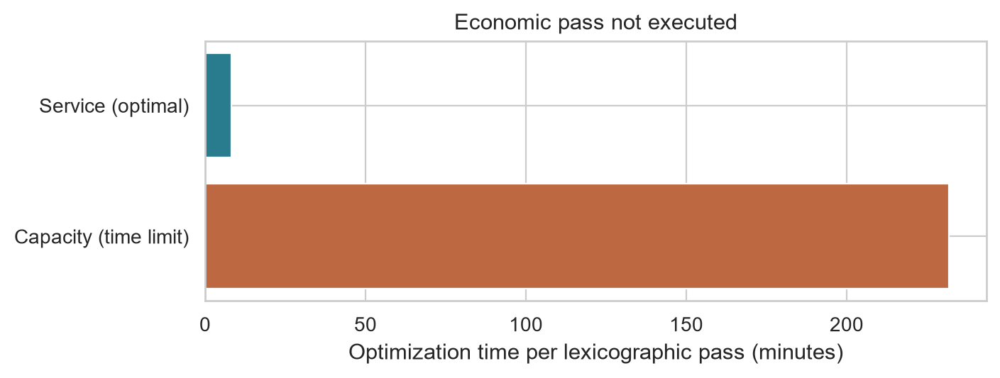

# Historical reference experiment (13 September 2026)

This retained supplement describes the original ten-reference, primarily
215-warehouse campaign. It is not the later thirteen-attempt solver comparison.
Relative figure paths refer to the manuscript directory. The original failed
certificate and resource-limited trials are preserved without reinterpretation.

## Reference validation and experimental coverage

The validation protocol accepted levels 1–3 and nine of ten selected reference
executions. The final warehouse-only nine-scenario trial attained the service
target and passed independent incumbent checks, but exhausted the optimization
budget during the capacity pass. Its economic pass was not executed. The
original ten-reference report therefore remains rejected, with level 4 recorded
as pending by the validator. The experimental campaign was closed with this
documented computational limitation rather than an amended success criterion.
The nine-scenario direct-arc reference was accepted.
This distinction is visible in @tbl-validation: an accepted service incumbent
and a completed optimization protocol answer different questions. A time-limited
or interrupted pass can yield useful feasible decisions without providing the
full comparative evidence required by the selected hierarchy. Earlier scalar
experiments cannot substitute for a missing service-first reference because
they optimize a different preference ordering.

| Evidence family | Selected executions | Accepted references | Remaining qualification |
|:--|--:|--:|:--|
| Bounded thesis-method, deterministic and three scenarios | 4 | 4 | New road snapshot and separate slacks; not numerical replication |
| Policy, deterministic and three scenarios | 4 | 4 | Interpretation conditional on service-first priorities |
| Policy, nine scenarios | 2 | 1 | Warehouse-only capacity pass reached the time limit |

: Observed validation coverage, not a ranking of logistics costs. {#tbl-validation}

## Road-network materialization and scalability preparation

The policy data preparation produced 63,289 ordered route records for 215
warehouses and 287,869 for 500 warehouses. In both materialization audits,
all records originated from OSRM and no Haversine fallback was reported.
These are pre-filter route records, not the arcs retained by the MILP.
The 500-warehouse build reused cached coordinate-pair results and added new
ones, demonstrating incremental distance preparation without demonstrating
optimization at that scale.

| Ordered route family | 215 warehouses | 500 warehouses |
|:--|--:|--:|
| Origin to warehouse (OD) | 7,955 | 18,500 |
| Warehouse to customer (DC) | 7,955 | 18,500 |
| Interwarehouse (DD) | 46,010 | 249,500 |
| Direct origin to customer (OC) | 1,369 | 1,369 |
| Total | 63,289 | 287,869 |

: Materialized route records before product expansion and sparsification. {#tbl-routing}

The increase is dominated by DD: its count follows $|W|(|W|-1)$ for $|W|$
warehouses. The retained graph subsequently depends on the per-group distance
rule and any connectivity repairs. Materialization success therefore removes
one data-engineering obstacle while leaving model size and solution quality
as separate experimental questions. Co-located facilities can share coordinate
cache entries without being the same investment candidate.

The numerical-integrity audit also identified small negative routing outputs
for nearly coincident coordinates. Such values are invalid distances, regardless
of their small magnitude. The subsequent integrity gate accepted the corrected
materialization. This episode establishes the need to validate cached and newly
queried values consistently; successful HTTP responses alone are insufficient
evidence of valid optimization coefficients.

## Domestic service and nominal capacity adequacy

The accepted service-first references establish the feasibility of their
domestic-service target within the stated numerical tolerances. They do not
establish adequacy of installed capacity. The conservation contract allocates
all modeled supply among domestic consumption, exports and final inventory;
capacity slacks identify where those allocations exceed nominal limits.
Consequently, a zero domestic-shortage score may coexist with a positive
capacity-violation score. Reporting only service fulfillment would conceal
this distinction, whereas rejecting every solution with capacity slack would
discard an intended diagnostic output.

Two quantities must remain separate: the best capacity score at the end of
the second pass and the score of the final economic solution. The hierarchy
allows only declared degradation of the former. A final increase within that
allowance is not additional installed capacity, and a pass-end objective is
not automatically the value of the final reported decisions. Independent
recomputation of both components, at warehouse-period resolution, is essential
to interpret this trade-off.

## Economic and computational interpretation

Final cross-configuration cost and investment estimates require the matching
frozen result exports, not merely a completed scheduler job. The available acceptance outcomes
support the functioning of the validation architecture, not a numerical claim
that direct arcs, stochastic investment or a specific facility plan is cheaper.
In particular, comparing a scalar penalty run against a lexicographic run
would confound the network treatment with the decision criterion.

For the reported nine-scenario retry pair, Slurm recorded 2 h 28 min 15 s and
successful completion for the direct-arc job, compared with 3 h 15 min 36 s and
failure for the warehouse-only job. Their maximum resident-set measurements
were approximately 45.8 and 54.8 GiB, respectively. These are observed
whole-job diagnostics, not primary optimization times or proof that direct
arcs generally reduce runtime. The failed execution is retained as incomplete
evidence rather than assigned an artificial runtime equal to the time limit.

The decomposition of execution time is important because EVPI and VSS require
additional solves. A comparison using end-to-end runtime would otherwise
penalize a configuration merely for requesting more post-optimality analysis.
Likewise, a small relative MIP gap can leave an absolute uncertainty interval
larger than the reported stochastic-value difference when Big-M penalties
dominate the objective. Economic interpretation requires both the component
decomposition and the bound-based interval in @eq-values.

## Configuration-level validation outcomes

@tbl-det-review and @tbl-sto-review summarize the selected experiments.
A configured stopping tolerance is not a measured gap. Reference acceptance
requires the relevant checks; it does not establish a unique investment plan,
exact optimality or historical numerical replication. Scalar and hierarchical
criteria remain distinct experimental families.

| Deterministic configuration | Reference outcome | Decision criterion |
|:--|:--|:--|
| Thesis-method, warehouse-only, alpha 0.8 | Accepted | Scalar penalties |
| Thesis-method, direct arcs, alpha 0.8 | Accepted | Scalar penalties |
| Policy, warehouse-only, 20% selection | Accepted | Three-pass hierarchy |
| Policy, direct arcs, 20%, 14,400 s | Accepted | Three-pass hierarchy |

: Deterministic reference outcomes under the declared validation contract. {#tbl-det-review}

| Stochastic configuration | Scenarios | Reference outcome |
|:--|--:|:--|
| Thesis-method, warehouse-only, alpha 0.8 | 3 | Accepted |
| Thesis-method, direct arcs, alpha 0.8 | 3 | Accepted |
| Policy, warehouse-only, 20% selection | 3 | Accepted |
| Policy, direct arcs, 20% selection | 3 | Accepted |
| Policy, direct arcs, 20%, 14,400 s | 9 | Accepted |
| Policy, warehouse-only, dual-simplex retry | 9 | Rejected: hierarchy incomplete |

: Stochastic reference outcomes. Acceptance of a service incumbent alone does
not imply completion of the capacity and economic passes. {#tbl-sto-review}

{#fig-validation-coverage}

{#fig-routing-growth}

The 500-warehouse route inventory is about 4.55 times the 215-warehouse
inventory, although the warehouse count rises by about 2.33 times.
Interwarehouse pairs explain the superlinear increase. This does not estimate
solve-time growth: product support, retained arcs, scenario count, presolve
and branching intervene. No 500-warehouse optimization result is asserted.

## Resource-limited nine-scenario evidence

The warehouse-only configuration provides a useful negative result.
Earlier attempts yielded usable incumbents but did not complete the required
hierarchy. Increasing the resource allowance did not by itself close the
economic-pass gap. Observed gaps of approximately 46.37% exceed both the
configured 1% target and a hypothetical 10% threshold. Changing a threshold
after observing these runs would not make either satisfy that threshold.

{#fig-retry-resources}

{#fig-incomplete-economic-gaps}

The final retry used dual simplex and four threads, with a 14,400 s
optimization limit, a 1% relative-gap target, a 192 GiB scheduler allocation
and a 128 GB solver soft-memory setting. Job 2091731 terminated after
4 h 5 min 46 s with a maximum resident-set size of approximately 27.25 GiB.
The service pass achieved zero unmet demand. The capacity pass then consumed
13,916.60 s and terminated at the time limit with an incumbent score of
$1.5907542160143\times10^{11}$ and a zero lower bound, giving a 100% gap.
The economic pass was not executed (@tbl-final-stages).

| Lexicographic pass | Termination | Incumbent | Best bound | Gap | Time (s) |
|:--|:--|--:|--:|:--|--:|
| Expected unmet demand | Optimal | 0 | $-2.85\times10^{-9}$ | Not informative at zero | 484.26 |
| Expected capacity violations | Time limit | $1.59075\times10^{11}$ | 0 | 100% | 13,916.60 |
| Economic cost | Not executed | — | — | — | — |

: Final warehouse-only nine-scenario trial. The first objective is in tonnes
of unmet demand; the second is the declared aggregate capacity-violation score,
not currency or installed capacity. The tiny negative service bound is numerical
noise. The raw relative-gap sentinel for that zero-valued pass is not an
economic or service shortfall. {#tbl-final-stages}

{#fig-final-stage-time}

The pass times sum to approximately 14,400.86 s. Whole-job elapsed time also
includes model preparation and reporting and must not be substituted for this
optimization measurement. The recorded failure is a failure to complete the
requested hierarchy within the budget, not a proof of infeasibility. Independent
checks accepted the incumbent's service and model constraints. Conversely,
a feasible incumbent with a 100% capacity gap is insufficient to support a
near-optimal capacity score or an economic comparison.

The final retry used less recorded resident memory than the earlier
warehouse-only attempts but did not solve the hierarchy. Because solver method,
thread count and resource settings differed, these observations do not isolate
a causal memory–runtime trade-off. They identify a reproducible adverse case
for subsequent algorithmic evaluation. Neither the 100% capacity gap nor the
earlier approximately 46.37% economic gaps satisfy a 1% or 10% threshold.

## Scope of comparative interpretation

The retained evidence supports comparisons of validation outcomes, network
size and observed computational resources. It does not supply a harmonized
set of final cost, transport-work and warehouse-period exports for every
configuration. Therefore, no cross-configuration investment ranking, estimated
economic benefit of direct arcs or final warehouse-only nine-scenario economic
optimum is inferred from the acceptance flags.

Transport work requires flow multiplied by directed road distance, not a count
of routes. Warehouse utilization requires matching stock, handling and installed
capacity records. Scalar EVPI/VSS additionally require comparable RP, WS and EEV
objectives and certified bounds under one frozen penalty vector; values from
different hierarchy levels are not interchangeable. These distinctions constrain
the claims that can be drawn from this computational experiment.
