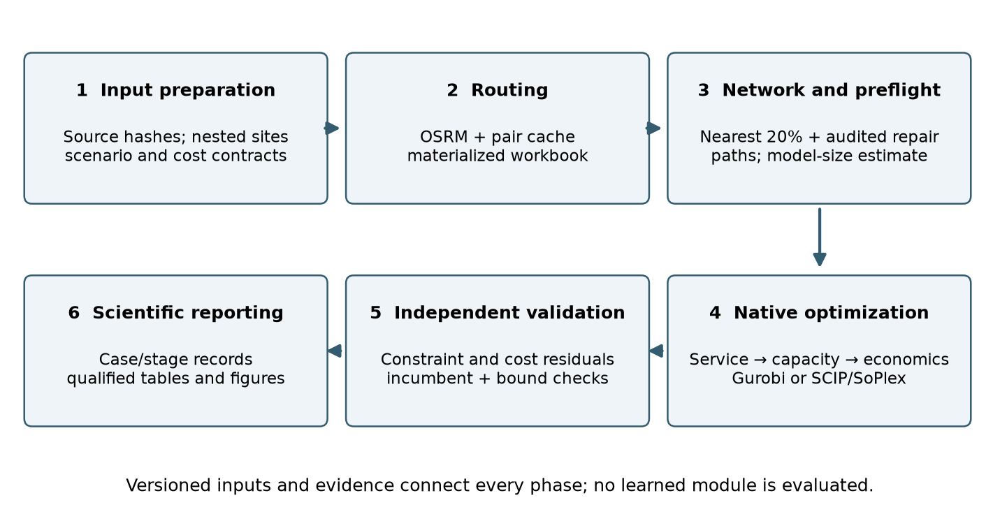

# Introduction

Post-harvest logistics poses a computational problem as well as an agricultural
planning problem. Adding candidate warehouses enlarges both the discrete
investment space and the potential interwarehouse network. Products, months and
uncertainty scenarios then replicate continuous flow and inventory decisions.
An executable formulation can consequently exceed practical construction,
memory or optimization budgets long before its mathematical specification
becomes difficult to write. The relevant research problem is how to construct,
execute and validate these large models without hiding changes to the network,
decision criterion or quality of the returned solution.

Grain-storage investment is simultaneously a location problem and a network
planning problem. A storage facility connects seasonal arrivals to consumption
and export outlets, while its static capacity and handling throughput constrain
different activities. A building with sufficient stock capacity may still be
unable to receive a harvest peak. Conversely, more reception throughput cannot
create an outlet for supply when the selected network is disconnected.

The literature provides complementary perspectives on these decisions.
@foulds2005 develops dynamic network-flow models for grain-silo location.
@dubke2011 study specialized terminals in Brazilian soybean exports, and
@steiner2017 examine a multi-objective approach to silo location in Paraná.
The review by @rosa2025 motivates integrating storage-location decisions with
uncertainty and heterogeneous warehouse and grain characteristics. These works
establish the application context, while computational work on agricultural
optimization and simulation demonstrates the need to distinguish algorithmic
decomposition, data preparation and distributed execution [@shastri2011;
@zhao2012; @knapen2025].

The mathematical and decision-support starting point is the doctoral thesis
of Artur Guerra Rosa, *Modelagem matemática e sistemas de apoio à decisão para
a logística de alocação e armazenagem de grãos no Brasil* [@rosa2026thesis].
The present model is inspired by that grain-allocation and storage-planning
foundation and revises its feasibility relaxation, decision priorities and
network construction for resource-bounded HPC experiments. A bounded
thesis-method reconstruction is distinguished from the extended policy model
with separate slacks, service priorities and expanded candidate data. The published review
@rosa2025 and the doctoral thesis are distinct contributions and are cited
separately.

Model Agrologistic investigates a computational workflow built around this
foundation. Its objectives are to make model growth and resource consumption
measurable; preserve the meaning of network and feasibility transformations;
and independently validate selected deterministic and stochastic results on an
HPC platform. The unit of evaluation is the complete, versioned experiment,
not only the final objective value. Public-investment interpretation supplies
the application motivation, but the principal contribution assessed here is
the software and experimental method that produces a qualified result.

# Related work and research positioning

## Grain-storage planning as an integrated decision problem

The systematic review by @rosa2025 places grain-warehouse location within a
broader family of mathematical planning models. Complementarily, @garima2024
organize grain supply-chain decision research around operational complexity,
risk, infrastructure, stakeholders and solution methods. Together, these
perspectives show why adding sites to a location model is insufficient: a
strategic design must connect storage, seasonal handling and access to markets.
The following synthesis compares published approaches along these substantive
dimensions; it does not claim a new independently executed systematic search.

Integrated wheat-network design in @gholamian2017 links infrastructure choices
to the organization of the supply chain. Scenario-based wheat planning in
@pourmohammadi2020 and sustainable, resilient network design in
@hosseini2020 extend this perspective to uncertain conditions and competing
performance concerns. These contributions motivate an integrated treatment,
but their commodity systems, constraints and objectives cannot be transferred
unchanged to a Brazilian grain-storage network. In particular, resilience to
disruption, seasonal variation and a numerical relaxation of capacity are
different concepts. A slack preserves a mathematical solution; it does not by
itself provide the transport, temporary equipment or institutional arrangements
that would make the physical network resilient.

Decision support also extends beyond optimization. @essien2018 address
sustainable multi-stakeholder grain storage, while @filippi2022 examine the
collective-action arrangements of rural warehouse condominiums. These studies
locate implementation within governance and stakeholder coordination. For a
public planning tool, candidate opening is therefore interpreted as an option
for appraisal, rather than a decision that can be executed without land,
financing, operating agreements or coordination among producers.

## Network representation and decision horizons

The foundational dynamic-network perspective connects storage investment to
flows across time rather than treating a silo solely as a point on a map
[@foulds2005]. In a Brazilian soybean setting, @mascarenhas2014 study
warehousing location with road and intermodal export connections. The
distinction is consequential: a throughput facility that transfers arrivals
onward is not interchangeable with a warehouse that carries inventory between
months. Static stock capacity, annual throughput and vehicle capacity must
therefore remain separate dimensions in a benchmark.

The logistics-integration-center formulation of @guimaraes2017 preserves
origin-destination demand relationships. By contrast, the present model
conserves each product but does not retain an origin label after it enters a
warehouse. Product from different origins can satisfy the same customer's
demand. This assumption is appropriate for a fungible-commodity planning
abstraction, but not for tracing contracts, quality lots or individual consignments.
It is a substantive difference in the feasible set, not simply a change of indices.

Terminal siting in @morais2023 connects location, capacity choices and
access to railways or waterways. @milanez2026 integrate soybean export
network design with hub functions and economies of scale. These studies
motivate reporting storage and transport decisions jointly. Nevertheless,
the present OSRM road matrix does not implement a multimodal assignment model.
A port destination is an export outlet, not an explicit maritime voyage; a
road segment near a railway does not create a rail arc.

| Study | Network and decision emphasis | Benchmark implication |
|:--|:--|:--|
| @foulds2005 | Dynamic grain-silo location and flow | Separate network size, capacity decisions and temporal flow |
| @mascarenhas2014 | Mato Grosso soybean warehouses and export connections | Distinguish throughput facilities from stock-carrying warehouses |
| @guimaraes2017 | Logistics integration centers and peer-to-peer demand | Commodity mixing differs from origin-destination preservation |
| @morais2023 | Capacitated terminals with intermodal location preferences | Modal access is not equivalent to a road-distance proxy |
| @milanez2026 | Hub location and soybean-export network design | Report hub function, capacity and route use together |
| @granillo2019 | Contract-farming network with simulation and MILP | Simulation-based uncertainty is not automatically two-stage recourse |
| @mendoza2021 | Scenario-based agro-food facility location | State which decisions precede the uncertain outcome |
| @vazquez2021 | Guayule/guar supply-chain design with sustainability criteria | Processing yields and sustainability constraints change comparability |
| @mogale2020 | Multi-echelon grain network with risk and losses | Losses and discrete transport resources require additional balances |

: Selected agricultural network-design studies and their implications for
comparability. The studies address different commodities and decision scopes. {#tbl-literature}

## Parameters, decisions and objective functions

Economic formulations typically connect fixed facility choices to continuous
material flows. The opening variable controls whether infrastructure can be
used, while installed capacity determines how much can be stored or handled.
A benchmark must distinguish a fixed-size site choice from scalable capacity:
both may contain a binary opening variable, but their investment feasible
sets differ. Counting producing regions or candidate sites is not an integer
decision variable unless the optimizer actually selects that count.

Agricultural models also differ in the economic boundary. Freight and
construction alone do not represent the same objective as freight, inventory,
processing, emissions, losses and employment. @mogale2020 include risk and
post-harvest losses in a green food supply-chain design. @vazquez2021 connect
supply-chain design to environmental and social impacts; @mogale2023 examine
social sustainability. Those dimensions are relevant to public planning but
are not current outputs of Model Agrologistic. We report neither avoided
emissions nor jobs created from a reduction in transport distance alone.

The cost evidence available to the present study is strongest at the
capacity-unit level. Introducing an arbitrary fixed construction charge on
top of a whole-project cost per tonne would risk counting part of the project
twice. Conversely, registry placeholders equal to zero do not establish that
investment is free. The data translation must state whether a quoted total
cost is represented by a fixed term, a capacity-proportional term, or a
documented decomposition. Sensitivity to uncertain investment costs is a
future economic analysis, not something to conceal through a large shortage
penalty.

Brazilian logistics costs also depend on more than distance. @kussano2012
analyze soybean export logistics using a broader cost accounting boundary,
including factors that can alter the ranking of modal alternatives. Accordingly,
OSRM distances in this study are inputs to a declared freight approximation,
not observed generalized logistics costs. Congestion, taxes, service contracts
and seasonally changing tariffs remain possible sources of divergence between
the least-cost modeled route and actual grain movements.

Spatial suitability and network optimization are complementary rather than
substitutable. @souza2024 use spatial multicriteria analysis for agricultural
warehouse location; such screening can constrain the candidate set before a
flow model allocates capacity. The present candidate population preserves
geographic and facility-type diversity but does not replace environmental,
land-use or engineering suitability assessment. Similarly, the wider
agricultural and carbon implications of Brazilian transport infrastructure
examined by @wang2024 lie outside a freight-and-storage objective. A shorter
modeled route cannot be interpreted automatically as a net environmental gain.

## Uncertainty and strategic interpretation

Uncertainty can enter a model through simulation, scenarios, robust
constraints or probabilistic objectives. These approaches answer different
questions. @granillo2019 combine a deterministic optimization model with
simulation in a barley contract-farming network. @mendoza2021 study
scenario-based facility location, while the adoption scenarios in
@vazquez2021 concern a different source of uncertainty. They should not be
classified as interchangeable simply because each uses multiple scenarios.

For soybean tactical planning, @reis2023 adopt a two-stage stochastic linear
program with first-stage purchasing and contracted transport. Our first stage
instead concerns long-lived warehouse decisions. The monetary gains in the
tactical study cannot serve as numerical validation of a strategic investment
model. Likewise, disruption and emergency-hub decisions in @maiyar2019 are
distinct from an emergency *slack*: the former represents a modeled physical
option, while the latter measures violation of nominal capacity.

Integrated decision support links planning horizons rather than treating
optimization in isolation [@mardaneh2021]. The joint crop-establishment,
harvesting and network-design perspective of @anselmino2025 provides another
example, in bioenergy rather than grain storage. Such work motivates clear
interfaces between data preparation, strategic investment and operational
evaluation. It does not imply that harvest scheduling or crop establishment
has been implemented in this demonstrator.

## Computational approaches in agricultural systems

@shastri2011 address a large agricultural optimization model through a
decomposition and distributed-computing approach to BioFeed, a biomass supply
planning problem. This is direct precedent for treating computational solution
strategy, rather than the use of a commercial optimizer alone, as a research
contribution. Our current extensive-form implementation does not reproduce
their decomposition or establish superiority over it.

@knapen2025 use standard big-data and distributed-computing technologies for
scalable crop-growth simulations. Their application illustrates a different
parallelization opportunity: distributing simulation work is not equivalent to
solving a MILP whose scenarios share first-stage integer decisions. @zhao2012
study parallelization and optimization of spatial analysis for environmental
model-data assembly. This distinction supports measuring data preparation
separately from the numerical solver rather than attributing all elapsed time
to optimization.

Shared-memory performance also requires explicit measurement. The PaScal Suite
of @silva2025pascal provides tools for evaluating and profiling parallel
scalability. Work on parallel dual revised simplex by @huangfu2018 shows that
parallelism may be organized within and across iterations. These references
motivate region-level timings and controlled thread-count experiments; they
do not imply that PaScal is integrated here or identify Gurobi's proprietary
internal algorithms.

| Computational layer | Published precedent | Present implementation and evidence boundary |
|:--|:--|:--|
| Agricultural MILP solution strategy | @shastri2011 | Native Gurobi and SCIP extensive forms; decomposition is future work |
| Distributed agricultural simulation | @knapen2025 | Slurm experiment scheduling, not a distributed scenario solver |
| Spatial data preparation | @zhao2012 | Versioned OSRM materialization and pair-cache reuse; no matched speedup benchmark |
| Shared-memory profiling | @silva2025pascal | Separate workflow timings; controlled thread-scaling study remains open |
| LP parallel algorithms | @huangfu2018 | Solver method and thread settings recorded, without claims about proprietary internals |

: Computational precedents and the boundaries of the present contribution.
These studies address different workloads and are not runtime baselines for
the present instances. {#tbl-computational-literature}

## Research gap and contribution

The gap addressed here concerns connecting an agricultural investment
formulation to a reproducible, resource-bounded experiment whose returned
solution can be checked independently. The cited literature establishes that
agricultural optimization, HPC, decomposition and profiling are not new. We do
not infer from this focused synthesis that no previous system combines these
ideas. Instead, we evaluate a concrete implementation that connects
provenance-aware road data, auditable network reduction, explicit mathematical
contracts, staged solver execution and validation of exported decisions.

Relative to @rosa2026thesis, the proposed extension is therefore computational
and methodological, with modeling differences declared rather than concealed.
Its investigator-developed tools expose failure at different layers: invalid
input data, lost connectivity, inconsistent units, infeasible exported
decisions, incomplete objective stages and exhausted computational resources.
Merely moving the historical model to a larger machine would not provide
these diagnostics. Conversely, their implementation alone does not establish
an algorithmic speedup; that requires matched comparative experiments.

Three research questions follow. First, how do retained network size and
scenario replication translate into measurable construction, memory and
optimization requirements? Second, can computational reductions and feasibility
relaxations preserve a declared planning contract that an independent validator
can verify? Third, which selected instances reach the declared solution-quality
and stage-completion requirements within an HPC resource budget? The current
evidence addresses selected executions; it does not resolve the complete
candidate-population frontier or isolate causal performance gains from every
software component.

# Materials and methods: mathematical framework

## Planning assumptions and notation

The deterministic formulation represents investment and operation under one
realization of supply and demand. The two-stage extension fixes infrastructure
before uncertainty is observed and permits scenario-dependent logistics.
Both formulations below describe the implemented conservation, activation and
capacity contracts; the separate relaxation and service-first extension are
identified explicitly.

The allocation and storage structure follows the methodological foundation of
@rosa2026thesis. Equations below describe the implemented version, including
its explicitly identified extensions; they are not a claim of literal or
numerical identity with every historical thesis configuration.

The model represents a multi-product, multi-period distribution network.
Existing warehouses remain available. Candidate warehouses become available
through investment. Domestic customer roles are distinct from export roles,
including when both refer to the same municipality. There is no production
decision: the supplied quantity is exogenous and must be allocated. Storage
losses, quality deterioration, product conversion, fleet scheduling and
transport lead times are outside this formulation. A shipment enters and
leaves its incident nodes within the same modeled period.

### Indices and sets

| Symbol | Definition |
|:--|:--|
| $o\in O$ | Supply origins |
| $w,v\in W$ | Warehouses; $w$ and $v$ distinguish sending and receiving sites |
| $W^E,W^N$ | Existing and candidate sites; a disjoint partition of $W$ |
| $W^X,W^B$ | Sites eligible for expansion and bulkification, respectively |
| $c\in C=C^D\cup C^X$ | Distinct domestic and export customer roles |
| $p\in P$ | Products |
| $t\in T=\{1,\ldots,H\}$ | Ordered monthly periods; $H$ is the horizon length |
| $s\in S$ | Scenarios in the stochastic model |
| $A^{OD},A^{DC},A^{DD},A^{OC}$ | Allowed origin-warehouse, warehouse-customer, interwarehouse and direct arcs, each indexed by product |
| $\mathcal A$ | Union of the four typed arc sets |

: Indices and sets. Arc sets are selected before optimization and remain frozen
across RP, WS, EV and EEV calculations. {#tbl-sets}

All sums over an arc are restricted to its allowed product-specific set.
An absent arc has no decision variable; it is not assigned an artificial
transport cost. Direct arcs disabled means $A^{OC}=\varnothing$. The
interwarehouse set excludes self-arcs. Expansion and bulkification eligibility
come from input data and feature flags, not from the notation alone.

### Parameters and physical dimensions

| Symbol | Meaning and unit |
|:--|:--|
| $a_{opt},D_{cpt},\overline E_{cpt}$ | Supply, domestic demand and export upper bound; tonnes per period |
| $I^0_{wp}$ | Initial inventory; tonnes |
| $K^0_w$ | Existing static capacity; tonnes |
| $R^0_w,H^0_w$ | Existing reception and shipping rates; tonnes/day |
| $d_t$ | Operating days in period $t$; days |
| $\overline k_w,\overline e_w,\overline b_w$ | Upper bounds on candidate, expansion and bulkification investments; tonnes on their declared investment basis |
| $\rho^N,\rho^X,\rho^B$ | Reception gains per investment tonne; day$^{-1}$ |
| $\eta^N,\eta^X,\eta^B$ | Shipping gains per investment tonne; day$^{-1}$ |
| $\ell^{OD}_{ow},\ell^{DC}_{wc},\ell^{DD}_{wv},\ell^{OC}_{oc}$ | Materialized directed distances; km |
| $f^O_o,f^W_w$ | Origin and warehouse freight rates; currency/(tonne km) |
| $\tau_w,h_{wp}$ | Receiving transshipment charge, currency/tonne; period inventory charge, currency/(tonne period) |
| $\alpha$ | Dimensionless interwarehouse freight multiplier |
| $F^N_w,F^X_w,F^B_w$ | Fixed opening, expansion and bulkification costs; currency |
| $c^N_w,c^X_w,c^B_w$ | Variable investment costs; currency/investment tonne |
| $\lambda^D_{cp},\lambda^K_w,\lambda^R_w$ | Shortage and separate capacity-violation penalty rates on the corresponding constraint units |
| $\pi_s$ | Scenario probability; positive and summing to one |

: Parameters. Currency units must match the input price basis; the equations do
not introduce a new price year, inflation adjustment or discount rate. {#tbl-parameters}

For candidates, $K^0_w=R^0_w=H^0_w=0$ in the canonical translation.
The factors $\rho$ and $\eta$ are explicit configuration parameters; a
historical coefficient equal to one still has units day$^{-1}$.
Bulkification is a handling investment expressed on a tonne-based costing
basis, not extra static storage. The daily-factor formulation below excludes
the archived period-equivalent interpretation.

### Decision variables

| Symbol | Domain and role |
|:--|:--|
| $y_w,\ w\in W^N$ | Binary candidate opening |
| $z_w,\ w\in W^X$ | Binary expansion activation |
| $g_w,\ w\in W^B$ | Binary bulkification activation |
| $k_w,e_w,b_w$ | Nonnegative candidate, expansion and bulkification investment quantities; tonnes |
| $x^{OD}_{owpt},x^{DC}_{wcpt}$ | Nonnegative origin-warehouse and warehouse-customer flow; tonnes in period $t$ |
| $x^{DD}_{wvpt},x^{OC}_{ocpt}$ | Nonnegative interwarehouse and direct flow; tonnes in period $t$ |
| $I_{wpt}$ | Nonnegative end-of-period inventory; tonnes |
| $u_{cpt},\ c\in C^D$ | Nonnegative unmet domestic demand; tonnes in period $t$ |
| $q^K_{wt}$ | Nonnegative static-capacity exceedance; tonnes of stock in period $t$ |
| $q^R_{wt}$ | Nonnegative reception overflow; tonnes handled during period $t$ |

: Deterministic variables. Under uncertainty, only flow, inventory and slack
variables acquire a scenario index; all investment variables are shared. {#tbl-variables}

For compact equations, investment variables outside their eligible sets are
defined as zero. Define availability $A_w=1$ for $w\in W^E$ and $A_w=y_w$
for $w\in W^N$. Availability is an expression, not another free binary.
Let $X=(y,z,g,k,e,b)$ collect investment decisions and $Y$ collect operations.

## Deterministic model

### Investment activation and nominal capacities

Candidate capacity is scalable in the selected reference experiments:

$$
0\le k_w\le\overline k_w y_w\quad(w\in W^N).
$$ {#eq-candidate}

Expansion and bulkification require both eligibility and activation:

$$
\begin{aligned}
0\le e_w&\le\overline e_w z_w,\quad z_w\le A_w &&(w\in W^X),\\
0\le b_w&\le\overline b_w g_w,\quad g_w\le A_w &&(w\in W^B),\\
z_w+g_w&\le A_w &&(w\in W^X\cap W^B).
\end{aligned}
$$ {#eq-investment}

The last inequality makes expansion and bulkification mutually exclusive at
a site eligible for both. Existing facilities are not charged an opening cost.
The fixed-size candidate option, when explicitly selected, replaces
@eq-candidate by $k_w=\overline k_w y_w$; it is not silently mixed into the
scalable experiment. No positive lower investment quantity is imposed, so
a zero-cost activation binary can be one with zero installed capacity.
Counts of binary decisions must therefore be interpreted alongside quantities.

Nominal stock and daily handling capacity are affine expressions:

$$
\begin{aligned}
K_w(X)&=K^0_w+k_w+e_w,\\
R_w(X)&=R^0_w+\rho^N k_w+\rho^X e_w+\rho^B b_w,\\
H_w(X)&=H^0_w+\eta^N k_w+\eta^X e_w+\eta^B b_w .
\end{aligned}
$$ {#eq-nominal}

@eq-nominal makes explicit why bulkification cannot be counted as
additional static capacity. Operating days convert the two handling rates,
but never the stock expression, into period quantities.

### Objective function and cost accounting

Unit transport costs include the charge at the receiving warehouse only
where a receiving-warehouse operation exists:

$$
\begin{aligned}
c^{OD}_{owp}&=f^O_o\ell^{OD}_{ow}+\tau_w, &
c^{DC}_{wcp}&=f^W_w\ell^{DC}_{wc},\\
c^{DD}_{wvp}&=\alpha f^W_w\ell^{DD}_{wv}+\tau_v, &
c^{OC}_{ocp}&=f^O_o\ell^{OC}_{oc}.
\end{aligned}
$$ {#eq-freight}

The current rates do not vary by product, although the flow variables do.
The interhub multiplier applies to freight, not to the receiving handling
charge. Direct transport is charged at the origin rate. These definitions
must be held fixed when comparing route policies.

The investment component is

$$
\begin{aligned}
C^{inv}(X)={}&\sum_{w\in W^N}(F^N_wy_w+c^N_wk_w)\\
&+\sum_{w\in W^X}(F^X_wz_w+c^X_we_w)\\
&+\sum_{w\in W^B}(F^B_wg_w+c^B_wb_w).
\end{aligned}
$$ {#eq-investment-cost}

For the fixed-size candidate option, its prescribed cost representation must
be used; the backend omits the candidate variable-cost term in that mode.
@eq-investment-cost describes the scalable reference used here.
Investment is paid once, not once per month. The model currently uses
undiscounted input costs rather than a net-present-value objective.

Writing $a$ for a typed product arc and $x_{at}$ for its corresponding flow,

$$
C^{op}(Y)=\sum_{t\in T}\sum_{a\in\mathcal A}c_a x_{at}
          +\sum_{w\in W}\sum_{p\in P}\sum_{t\in T}h_{wp}I_{wpt}.
$$ {#eq-operating-cost}

The feasibility-penalty component is

$$
\begin{aligned}
P(Y)={}&\sum_{c\in C^D}\sum_{p\in P}\sum_{t\in T}\lambda^D_{cp}u_{cpt}\\
&+\sum_{w\in W}\sum_{t\in T}
  \left(\lambda^K_wq^K_{wt}+\lambda^R_wq^R_{wt}\right).
\end{aligned}
$$ {#eq-penalty}

The scalar deterministic MILP minimizes

$$
Z_D=\min_{X,Y}\left\{C^{inv}(X)+C^{op}(Y)+P(Y)\right\}.
$$ {#eq-det-objective}

The penalty coefficients are feasibility devices, not observed social
shortage costs. In the thesis-derived dynamic rule, capacity rates are based
on fifty times the largest reference expansion or storage rate, with a floor;
customer shortage rates use one hundred times the largest applicable selected
route, expansion or storage rate. The implementation freezes the resulting
vector before stochastic projection. Such cross-component Big-M calibration
is heuristic and does not turn the penalty total into a financial estimate.

### Supply, demand and inventory constraints

All supplied grain leaves each origin through allowed arcs:

$$
\sum_{w:(o,w,p)\in A^{OD}}x^{OD}_{owpt}
+\sum_{c:(o,c,p)\in A^{OC}}x^{OC}_{ocpt}=a_{opt}
\quad(o\in O,p\in P,t\in T).
$$ {#eq-supply}

This equality also applies to zero supply. There is no disposal variable and
no permission to leave excess production unallocated at its origin.

Define product-specific inflow and outflow at a warehouse by

$$
\begin{aligned}
B^{in}_{wpt}&=\sum_{o:(o,w,p)\in A^{OD}}x^{OD}_{owpt}
             +\sum_{v:(v,w,p)\in A^{DD}}x^{DD}_{vwpt},\\
B^{out}_{wpt}&=\sum_{c:(w,c,p)\in A^{DC}}x^{DC}_{wcpt}
              +\sum_{v:(w,v,p)\in A^{DD}}x^{DD}_{wvpt}.
\end{aligned}
$$ {#eq-inout}

These are expressions, not additional inventory or capacity decisions.
Conservation at each warehouse is

$$
I_{wpt}=I_{wp,t-1}+B^{in}_{wpt}-B^{out}_{wpt},
\quad I_{wp,0}=I^0_{wp}\qquad(w,p,t).
$$ {#eq-inventory}

The first modeled period uses the supplied initial stock. Subsequent periods
use the previous end-of-period stock. Product balance does not permit soybean
to satisfy corn demand or convert a reception overflow into material.

Domestic demand must be met by deliveries plus explicitly reported shortage:

$$
\sum_{w:(w,c,p)\in A^{DC}}x^{DC}_{wcpt}
+\sum_{o:(o,c,p)\in A^{OC}}x^{OC}_{ocpt}+u_{cpt}=D_{cpt}
\quad(c\in C^D,p,t).
$$ {#eq-service}

Exports are optional outlets with upper bounds:

$$
\sum_{w:(w,c,p)\in A^{DC}}x^{DC}_{wcpt}
+\sum_{o:(o,c,p)\in A^{OC}}x^{OC}_{ocpt}\le\overline E_{cpt}
\quad(c\in C^X,p,t).
$$ {#eq-export}

An explicitly unbounded export role has no restrictive finite export ceiling.
There is no export-revenue maximization in @eq-det-objective. The model chooses
between feasible storage and export outlets through costs and constraints, not
through a selling-price forecast.

### Static, reception and shipping capacities

Shared warehouse capacity applies across products:

$$
\sum_{p\in P}I_{wpt}\le K_w(X)+q^K_{wt}\qquad(w,t).
$$ {#eq-static}

$$
\sum_{p\in P}B^{in}_{wpt}\le d_tR_w(X)+q^R_{wt}\qquad(w,t).
$$ {#eq-reception}

$$
\sum_{p\in P}B^{out}_{wpt}\le d_tH_w(X)\qquad(w,t).
$$ {#eq-shipping}

Reception slack in @eq-reception is added **after** daily capacity has been
converted into a period quantity. It is consequently measured in tonnes,
not tonnes/day. A daily overflow equivalent is $q^R_{wt}/d_t$.
Multiplying the slack by 30 in the objective would perform an unsupported
second conversion. Shipping has no emergency slack in this implementation.

Closed candidates cannot use either emergency variable:

$$
y_w=0\ \Longrightarrow\ q^K_{wt}=q^R_{wt}=0
\qquad(w\in W^N,t\in T).
$$ {#eq-indicator}

These are indicator constraints, not arbitrary finite upper bounds on
emergency quantities at an active facility. Combined with zero candidate base
capacities and the activation restrictions, they prevent an unopened site
from acting as an uncharged warehouse.

The variable domains in @tbl-variables complete the MILP. Terminal stock
$I_{wpH}$ is free within the balance and capacity constraints; it is not forced
to zero or to its initial value. No terminal salvage or additional terminal
penalty is implemented in the selected contract.

### Feasibility and interpretation

Summing the supply and inventory equations cancels internal transfers and gives

$$
\sum_{o,p,t}a_{opt}+\sum_{w,p}I^0_{wp}
=\sum_{c,p,t}\left(\sum_w x^{DC}_{wcpt}+\sum_o x^{OC}_{ocpt}\right)
 +\sum_{w,p}I_{wpH}.
$$ {#eq-balance}

This identity includes both domestic and export deliveries. Unmet demand is
not a material outlet and must not appear on its right-hand side.
An aggregate residual near zero is necessary, but local product-period errors
could cancel. The independent validator consequently checks each underlying
equality as well as the aggregate.

The three slacks do not prove complete recourse for arbitrary data.
An isolated positive-supply origin, an impossible shipping requirement or an
incompatible activation structure can still make the model infeasible.
Emergency use is admissible as a capacity-gap diagnosis; it is not proof that
a corresponding real warehouse project can be built at the penalized cost.

## Two-stage stochastic model

### Information structure and scenario parameters

Investment $X$ is chosen before the uncertain supply and demand trajectory is
known. Scenario $s$ specifies $a^s_{opt}$, $D^s_{cpt}$ and, where applicable,
$\overline E^s_{cpt}$. Routes, distances, investment costs, operating-day
conventions and the penalty vector remain common. Initial inventory is also
common to all scenarios. Each recourse variable receives an index $s$:
$x^{OD,s},x^{DC,s},x^{DD,s},x^{OC,s},I^s,u^s,q^{K,s},q^{R,s}$.

This is two-stage, not multistage, planning: after the scenario is realized,
the entire operating trajectory is available to that scenario's recourse
problem. It does not enforce progressive monthly revelation of information.
A multistage scenario tree with history-dependent nonanticipativity would
be a different formulation.

The deterministic equivalent is

$$
Z_{RP}=\min_{X,\{Y^s\}_{s\in S}}
 C^{inv}(X)+\sum_{s\in S}\pi_s\left[C^{op}(Y^s)+P(Y^s)\right].
$$ {#eq-rp}

The first-stage feasible set is exactly @eq-candidate and @eq-investment
with the same binary domains. It is imposed once, and investment cost is
counted once. Using a common $X$ implements nonanticipativity directly.
If replicated variables $X^s$ were used instead, one would need
$X^s=X^{s'}$ for every scenario pair; the implementation avoids that replication.

### Scenario-indexed constraints

For every $s\in S$, the operational constraints are

$$
\sum_w x^{OD,s}_{owpt}+\sum_c x^{OC,s}_{ocpt}=a^s_{opt}
\qquad(o,p,t,s),
$$ {#eq-sto-supply}

$$
I^s_{wpt}=I^s_{wp,t-1}+B^{in,s}_{wpt}-B^{out,s}_{wpt},
\quad I^s_{wp,0}=I^0_{wp}\qquad(w,p,t,s),
$$ {#eq-sto-inventory}

$$
\sum_w x^{DC,s}_{wcpt}+\sum_o x^{OC,s}_{ocpt}+u^s_{cpt}
=D^s_{cpt}\qquad(c\in C^D,p,t,s),
$$ {#eq-sto-domestic}

$$
\sum_w x^{DC,s}_{wcpt}+\sum_o x^{OC,s}_{ocpt}
\le\overline E^s_{cpt}\qquad(c\in C^X,p,t,s),
$$ {#eq-sto-export}

$$
\begin{aligned}
\sum_p I^s_{wpt}&\le K_w(X)+q^{K,s}_{wt},\\
\sum_p B^{in,s}_{wpt}&\le d_tR_w(X)+q^{R,s}_{wt},\\
\sum_p B^{out,s}_{wpt}&\le d_tH_w(X)
\qquad(w,t,s).
\end{aligned}
$$ {#eq-sto-capacity}

All arc sums retain the restrictions of @eq-inout. Each candidate indicator
also holds for every $t,s$, and every recourse variable is nonnegative.
There is no probability multiplier in a physical balance or capacity
constraint: probabilities weight the objective and reported expectations,
not the tonnes available within one scenario.

Equivalently, define $Q(X,\xi_s)$ as the minimum operating-plus-penalty cost
subject to this scenario system. Then
$Z_{RP}=\min_{X\in\mathcal X}\{C^{inv}(X)+\sum_s\pi_sQ(X,\xi_s)\}$.
This recourse representation clarifies that scenario-specific operation
cannot repair an investment decision by independently opening a new site.

## Separate slacks and service-first policy extension

The historical shared-capacity slack and the current separate slacks are not
economically equivalent. For fixed exceedances $a,b\ge0$ and a common positive
penalty rate $\lambda$, a shared variable incurs $\lambda\max(a,b)$.
Independent variables incur $\lambda(a+b)$. The present reproduction therefore
retains thesis-method elements while explicitly changing the relaxation.
Numerical equality with historical objective values is not asserted.

The policy extension preserves the constraints but changes the objective
ordering. Let the expected shortage and capacity-violation score be

$$
U=\sum_s\pi_s\sum_{c\in C^D,p,t}u^s_{cpt},
\qquad
V=\sum_s\pi_s\sum_{w,t}(q^{K,s}_{wt}+q^{R,s}_{wt}).
$$ {#eq-policy-scores}

It solves

$$
\operatorname{lexmin}\left(U,\ V,\ C^{inv}(X)+
                                      \sum_s\pi_sC^{op}(Y^s)\right).
$$ {#eq-hierarchy}

The deterministic policy is the singleton-scenario specialization.
The ordering first seeks zero unmet domestic demand, then reduces nominal
capacity violations, and finally minimizes economic cost. A zero first-stage
shortage objective is feasible evidence of service fulfillment, but a complete
hierarchy additionally requires the remaining two passes to finish.

Although both components of $V$ use tonne-based constraint quantities, their
aggregation has a chosen meaning: static exceedance summed over periods is a
stock-violation measure, while reception overflow sums handled material.
Their equal-weight sum is a **violation score**, not installed storage
capacity or a uniquely justified social preference. We separately report
component sums, warehouse-period peaks and reception daily equivalents.
A future change in weights would be a policy experiment, not a units correction.

Priority preservation is tolerance-qualified. Relative and absolute MIP gaps
and objective-degradation tolerances may permit a later pass to worsen an
earlier objective within a declared allowance. Pass-end values, final values,
bounds and statuses must be reported together. Classical scalar EVPI/VSS,
defined below, cannot be attached automatically to this vector objective.

# Materials and methods: data lineage and network construction

The study separates the historical benchmark source pool, a normalized bounded
instance, and an expanded canonical workbook. Duplicate-key normalization
preserves material totals; candidate translation distinguishes registry
placeholders from genuine investment costs. The policy reference contains 215
warehouses, comprising 146 existing facilities and 69 candidates. A nested
sequence contains 300, 400 and 500 warehouses, with 146 existing facilities
preserved in each population. Optimization was evaluated at 215, 300 and 400;
materialization at 500 is not evidence of an optimized 500-warehouse instance.

OSRM v6.0.0, the driving profile, MLD preprocessing and the dated
`brazil-260901` extract define the road-distance authority. Distances are
materialized before optimization; the solver never queries a live routing
service. The Table service returns distance along the profile-selected fastest
route, which is not necessarily the shortest-distance road path. Ordered
coordinate pairs, dataset/profile identity and query policy identify cached
entries. Routing failures do not silently become straight-line distances.
Only declared no-route or excessive-snap cases admit audited Haversine fallback.
The materialized 215, 300, 400 and 500 populations required no fallback.

The historical grouped rule retains the nearest ceiling 20 percent of eligible
edges per sending-node/product group. It is a sparsification rule, not a proof
of Pareto optimality. The policy profile adds explicit connectivity repairs
from eligible routes when required; added edges are reported separately. Direct
origin-to-customer arcs form a controlled on/off factor. Interwarehouse freight
uses a separate interhub factor, $\alpha$. Physical routing coverage and
post-filter customer reachability are different diagnostics.

The present OSM snapshot and the unreconstructed forecasting path differ from
the thesis inputs. Accordingly, the correct claim is a bounded **thesis-method
comparison with separate slacks**, followed by a policy extension. Exact
replication of published thesis cost tables is not an acceptance criterion.

## Multi-hop interwarehouse connectivity and computational pipeline

For each sending warehouse and product, the baseline retains the nearest
$\lceil0.2(|W|-1)\rceil$ eligible directed interwarehouse arcs. The algorithm
then audits strong connectivity and, where necessary, adds explicitly recorded
eligible repair edges. The final retained fraction includes both rounding and
repairs. Multi-hop paths need not be direct edges, and a strongly connected
candidate graph does not guarantee that the subset of opened warehouses has
sufficient capacity. Both distinctions are checked separately from road routing.

The retained fractions in the tested networks were 20.093458%, 20.066890% and
20.050125% for 215, 300 and 400 warehouses, respectively, for each product.
The recorded repair counts were zero. The excess over 20% therefore reflects
integer rounding rather than undocumented additional routes. The connectivity
audit, component membership, repair-edge list and path summary preserve the
network-construction evidence.

{#fig-pipeline}

The phases in @fig-pipeline produce, respectively, source/population manifests;
OSRM workbooks, cache and provenance audits; scenario, size and connectivity
reports; native logs and stage bounds; independent constraint and cost checks;
and versioned tables and figures. An immutable experiment definition links the
phases. Scenario construction is an experimental input transformation, not
offline machine-learning training. Predictive accuracy, forecast calibration
and learned solver guidance are outside the evaluated pipeline.

# Materials and methods: experimental and validation protocol

The selected reference design is deliberately smaller than the available
factorial configuration space. @tbl-design describes the comparison
without exposing internal gate numbers as scientific treatment labels.

| Profile | Scenarios | Direct arcs | Interpretation |
|:--|:--|:--|:--|
| Bounded thesis-method | 1 and 3 | Off / on | $\alpha=0.8$, grouped 20 percent, separate slacks |
| Policy, 215 warehouses | 1, 3 and 9 | Off / on | Service-first, 20 percent plus connectivity repair |

: Selected reference design: four thesis-method and six policy executions. {#tbl-design}

The coupled three-scenario thesis profile uses probabilities 0.33, 0.34 and
0.33 with low, central and high supply/demand factors. Policy scenarios are
defined in separate versioned manifests; their design is not an empirical
probability forecast. Three versus nine scenarios therefore compares specified
experimental distributions, not a statistical convergence guarantee.

The initial references provide a historical validation baseline. The subsequent
nine-scenario experiment evaluates native Gurobi and SCIP/SoPlex implementations
under a nominal 28,800-second global optimization budget and a 10% relative-gap
target for the capacity and economic passes. The service target uses an absolute
zero-within-tolerance certificate; a relative gap at a zero objective is not
informative. All three priorities must finish, and an independent incumbent
validation must pass, before an attempt is classified as quality-certified.

The comparison contains seven Gurobi attempts at 215, 300 and 400 warehouses
and six SCIP attempts at 215 and 300. Each population has warehouse-only and
direct-enabled treatments. A separately identified Gurobi warehouse-300
all-barrier repeat and two SCIP enlarged-memory repeats are retained alongside
their predecessors. These are treatment attempts, not statistical replicates.
The 400-warehouse SCIP cases reached input preflight only and are excluded from
the solve denominator. No 500-warehouse optimization is reported.

The nine scenarios are the Cartesian product of three supply and three demand
levels, with two products and 60 periods. First-stage investment decisions
are shared. Network settings, the 30-day capacity convention and scenario
summaries were reconciled between solver records. Native SCIP support covers
the stochastic hierarchy; deterministic SCIP, SCIP EVPI/VSS and SCIP IIS are
not evaluated. Small analytical and licensed parity tests establish a separate
software-qualification layer, not a guarantee of large-instance convergence.

Gurobi uses its hierarchical objectives and pass-specific environments.
The historical automatic profile leaves the root method at its default;
the all-barrier profile explicitly selects barrier for all priorities.
SCIP/SoPlex executes sequential objectives with explicit inherited-priority
constraints and a shared remaining-time budget. The recorded build does not
implement the Gurobi all-barrier profile. Both backends report native and
common bound conventions rather than assuming identically named gaps have
identical definitions. Relative MIP tolerance also enters Gurobi's inherited
base value: zero explicit objective-relative tolerance alone does not imply
that a later pass cannot degrade the previous incumbent.

Validation has four levels: mathematical/data contracts; software and licensed
analytical tests; independent solution validation; and the selected HPC
demonstration. Acceptance requires matching implementation, runtime, data and
configuration identities. Old evidence remains attached to its original
identity even when later source changes are only documentation changes.

Data reading, backend construction and `model.optimize()` have separate clocks.
Post-optimality computations for stochastic-value analysis require additional
solves and must be reported separately from primary optimization. Slurm elapsed
time includes orchestration and must not substitute for the optimizer clock.
An end-to-end reporting table must distinguish these intervals and disclose
cache reuse rather than adding overlapping measurements.

## Value of information and stochasticity

Following the two-stage recourse interpretation of @birge2011, for comparable
minimization problems on the same frozen scalar objective,

$$
EVPI=Z_{RP}-Z_{WS},\qquad VSS=Z_{EEV}-Z_{RP}.
$$ {#eq-values}

WS optimizes first-stage decisions independently by scenario; EEV evaluates the
expected-value investment plan in the stochastic environment. Both metrics
require additional optimization and component-level cost accounting. A large
penalty-driven VSS is not a monetized economic benefit. Investment, operating
and penalty differences must be presented separately.

If $L$ and $U$ denote valid objective bounds and incumbent values, an EVPI
interval is $[L_{RP}-U_{WS},\ U_{RP}-L_{WS}]$; similarly a VSS interval is
$[L_{EEV}-U_{RP},\ U_{EEV}-L_{RP}]$. An interval crossing zero is numerically
indeterminate, not evidence of negative theoretical stochastic value. Classical
monetary EVPI/VSS is not automatically assigned to the service-first vector
objective in @eq-hierarchy.

## HPC experimental environment

Computational experiments were executed at the Núcleo de Processamento de Alto
Desempenho (NPAD), Federal University of Rio Grande do Norte (UFRN), Brazil,
under Slurm. The official infrastructure description lists Intel nodes with
two 16-core Xeon E5-2698 v3 processors at 2.3 GHz, DDR4 memory and InfiniBand
interconnects; the Intel partitions distinguish 128, 256 and 512 GB node-memory
classes [@npad2026]. Node specifications are distinct from the resources
allocated to an individual job. The later comparison configured four solver
threads and used CPU execution; no GPU acceleration is claimed. Gurobi 13.0.3
ran in the 256 GB node class with 192 GiB requested from Slurm and a 128 GB
internal soft-memory setting. Native SCIP 10.0.2 with SoPlex 8.0.2 and
PySCIPOpt 6.2.1 used a 131072 MB internal limit initially. Its enlarged-memory
300-warehouse repeats used 393216 MB and exclusive 512 GB-class nodes,
with 512000 MiB (500 GiB) reported scheduler allocation. These configured
internal limits are not process RSS ceilings or intrinsic solver maxima.

Scheduler accounting assigned 24 CPUs to the original SCIP jobs and 64 to
the enlarged-memory jobs, despite four configured solver threads. Allocated
CPU counts therefore do not establish the degree of solver parallelism.
Python 3.13.15 was used; the archived Gurobi and SCIP environments also differ
in NumPy version (2.5.2 and 2.5.3). The comparison is descriptive, not a
hardware- and runtime-controlled speedup benchmark.

The runtime and package versions, source identity, workbook hashes, experiment
parameters and license-dependent test outcomes are captured with each evidence
package. OSRM preprocessing is a separate workload from model construction and
optimization. Persistent pair caching avoids repeated routing requests; neither
cache retrieval nor road-network preprocessing is charged to `model.optimize()`.
Slurm completion records and process memory accounting supplement, but do not
replace, application-level timings and independent solution checks.

## Model size, memory and performance measurement

Let $n_W=|W|$ be the number of warehouses and let $\mathcal A_p$ denote the retained
directed arcs eligible for product $p$. The flow-variable count in an extensive
form with a common arc set across scenarios is
$|S||T|\sum_p|\mathcal A_p|$. Inventory adds terms proportional to
$|S||T||W||P|$; slacks and first-stage investment decisions add their own
separately counted blocks. These are structural counts, not a polynomial-time
complexity claim for the MILP. The preflight reports the count for the actual
instantiated index sets rather than assuming every theoretical arc exists.

Before screening, the directed interwarehouse graph contains at most
$n_W(n_W-1)$ arcs. Retaining a fixed fraction does not remove this quadratic growth.
Scenario replication enlarges the continuous relaxation and stored matrix,
whereas integer facility decisions influence the branch-and-bound search.
Neither variable count nor warehouse count alone predicts solution time:
connectivity, coefficient scaling, relaxation strength, degeneracy and the
objective hierarchy can change the search substantially.

The experimental unit is therefore a frozen input/configuration pair together
with its resource allocation. Reports separate data reading, backend model
construction, primary optimization, post-optimality analysis, validation and
export where available. Missing historical timings remain missing; they are
not reconstructed by subtracting overlapping clocks. For a service-first run,
stage-specific objective bounds, gaps and completion states accompany the
total optimizer time. For scalar EVPI/VSS analysis, auxiliary solves must not
be counted as a speed penalty of the primary RP solve.

Current jobs solve an extensive-form MILP within one allocated node; Slurm
arrays distribute independent experiments. This is not a distributed MILP
solver, and no multi-node speedup is claimed. A future strong-scaling test
would hold model, objective, stopping rules and hardware fixed while varying
threads, report repeated trials and compare $T_1/T_p$ and $(T_1/T_p)/p$.
Region-level profiling, as motivated by @silva2025pascal, can then distinguish
serial data preparation from solver work. Present memory and elapsed-time
observations establish resource requirements for selected cases, not parallel
efficiency estimates.

# Results

## Historical reference experiment

The initial deterministic and three-scenario validation established the
mathematical, software and independent-solution checks for eight selected
configurations. One of two nine-scenario references also completed the original
protocol. The final warehouse-only retry attained zero domestic shortage but
reached the 14,400-second budget with a 100% capacity gap; its economic pass was
not executed. The original ten-reference report therefore remains rejected.
This earlier experiment motivated, but is not pooled with, the enlarged
28,800-second, 10%-gap comparison below. Its detailed stage tables and resource
figures are retained in the historical reference supplement.

## Network size and road-data preparation

The road inventory contains 63,289, 113,269, 190,569 and 287,869 ordered records
for 215, 300, 400 and 500 warehouses. These are pre-filter route records,
not the arcs retained by the MILP. Every reported record uses OSRM, with no
Haversine fallback. Coordinate-pair reuse reduces routing work without merging
distinct facilities. The integrity checks normalize small negative routing
artifacts under the documented numerical policy and preserve their audit counts.

{#fig-routing-growth}

With nine scenarios and 60 periods, warehouse-only extensive forms contain
14,054,654, 25,107,544 and 42,106,944 estimated variables at 215, 300 and 400
warehouses. Enabling direct arcs adds 319,680 variables in each case.
The increase from 215 to 400 nearly triples model size despite retaining only
about one fifth of interwarehouse edges. Strong connectivity preserves paths,
but does not remove the quadratic arc-growth term.

## Solver outcomes and resource requirements



Four of seven Gurobi attempts completed the three-pass hierarchy at the
declared quality target. Both 215-warehouse route variants were accepted.
At 300 warehouses, the historical warehouse-only attempt reached an economic
gap of 50.520259%, whereas its separately identified all-barrier repeat
completed with 0.083114%. The direct-enabled attempt completed with a
0.067684% economic gap. Its capacity gap was 1.287429%: acceptable under the
10% campaign rule, but not under a hypothetical 1% rule. A configured tolerance
must not be substituted for the attained gap.

At 400 warehouses, both all-barrier runs returned independently valid
incumbents but remained time-limited. The warehouse-only case stopped in
the capacity pass at 100%, without an economic pass. The direct-enabled case
completed capacity at 0.064253% but stopped in economics at 99.999813%.
These final all-barrier outcomes are time limits, not the memory limits
observed during earlier mixed-method diagnostics. Reaching a feasible network
and certifying all objective priorities are different computational tasks.

All six SCIP attempts terminated without an incumbent. The 215-warehouse
cases exhausted the optimization budget in the first-stage solve. At 300,
the original 131072 MB internal-memory profile stopped during presolve.
Repeats with 393216 MB, larger node allocations and otherwise identified
inputs reached the time limit instead. Their peak application RSS was
approximately 154--155 GiB, below the enlarged configured budget.
The additional memory removed the early observed stop but did not yield a
solution. Because allocation and hardware also changed, this is not an isolated
estimate of the causal effect of memory.

The presolved first service-pass SCIP problem at 215 warehouses retained
approximately 12.45 million continuous variables and 394 thousand constraints
in the warehouse-only case. Removing discrete variables in that transformed
pass did not make its large LP inexpensive; nor does it imply that the
original investment hierarchy is a continuous optimization problem.
The later hierarchy still has to preserve investment and priority semantics.

## Service, capacity and economic interpretation

All quality-certified Gurobi cases attained domestic service within the
absolute certificate, including scenario-wise checks. Their positive capacity
violations show that service fulfillment is not a claim of nominal
infrastructure adequacy. The static score accumulates stock exceedance over
warehouse-periods; reception overflow measures material above period handling
limits. Neither their sum nor a large penalty total is an installed-capacity
recommendation.

The accepted economic costs in @tbl-economic-observations are conditional
model outputs, not observed expenditures. Within the accepted pairs, the
direct-enabled values are lower than the warehouse-only values, but the
capacity-priority limits inherited by their economic passes are not identical.
Consequently, their difference is not an identified benefit attributable solely
to direct arcs. It would require a controlled common-priority comparison,
followed by sensitivity to freight and investment assumptions, to interpret
a policy effect.

The distinction between pass and final scores is material. For the accepted
300-warehouse, warehouse-only all-barrier run, the capacity-pass score was
328,334,362.50, while the final economic solution used 360,354,208.20 within
the recorded inherited limit. This is permitted degradation under the chosen
hierarchy, not evidence that the capacity objective was minimized exactly.
Stage-level gaps and final decisions must therefore be read together.

## Evidence coverage and predictive scope

The comparative record reconciles eleven audit-declared campaign identities
and 81 supplied completion-bound artifact hashes. Eight cross-solver pairings
match exported workbook identifiers, model and loader settings, scenario
summaries, route counts and connectivity audits. This establishes agreement
of the supplied input records, not a new comparison of absent workbook bytes,
full coefficient matrices or complete solution vectors. The independent
feasibility results are the original archived validations.

No SCIP cost, service attainment or finite optimality gap is imputed when an
incumbent is absent. In particular, default service fields are not interpreted
as successful fulfillment. No predictive experiment is included: the scenario
levels are controlled realizations, not validated forecasts. Accordingly,
forecast accuracy, calibration gains and learned-policy benefits remain
unmeasured rather than being inferred from optimization outcomes.

# Discussion and limitations

## Observed computational boundary

The largest tested population with complete, quality-certified Gurobi results
is 300 warehouses. At 400, valid incumbents exist but the hierarchy is incomplete
or insufficiently bounded within the eight-hour optimization budget. This is
an observed boundary of the evaluated profiles, not a proof that no alternative
method could solve 400 or that every smaller instance is easy. The absence of
SCIP incumbents at 215 and 300 likewise identifies an unresolved region rather
than locating a smaller certified SCIP frontier.

The accepted warehouse-300 all-barrier attempt and the unsuccessful automatic
attempt demonstrate sensitivity to the solution profile. Without repeated,
hardware-matched runs, they do not establish a general algorithmic speedup.
At 400, the bottleneck can move from capacity to economics even after the
service objective is solved. This motivates reporting each pass rather than
using service fulfillment or a scheduler exit code as the overall success
criterion. Scalar penalty totals do not replace the missing economic certificate.

The SCIP outcomes show a second mechanism: a large transformed LP can consume
the available time before producing any incumbent. Raising a memory budget
does not resolve that mechanism automatically. A useful solver comparison
therefore separates time-limited no-incumbent outcomes, memory-limited presolve,
valid but uncertified solutions and complete quality-certified hierarchies.
Cost ratios against missing SCIP solutions and average speedups across these
heterogeneous outcomes would be misleading.

## Computational contribution and limits of the evidence

The principal contribution is an inspectable software workflow for large
agricultural network experiments, rather than an additional application of
an optimizer to a grain dataset. Model-size preflight, provenance-aware road
materialization, connectivity diagnostics, independent residual validation
and stage-level reporting make different failure mechanisms observable.
Their scientific value is to prevent a faster but changed model, an
unvalidated incumbent or an incomplete objective hierarchy from being reported
as an equivalent successful computation.

This position complements, but does not supersede, agricultural decomposition
research [@shastri2011] and distributed simulation research [@knapen2025].
The current records demonstrate execution and diagnostic coverage, not a
matched ablation showing the isolated benefit of each component. In particular,
pair-cache hits demonstrate reuse, but do not by themselves quantify an
end-to-end speedup; network screening reduces model size but can alter the
feasible set. Such reductions must be assessed jointly with connectivity and
planning outcomes. A stronger computational evaluation would compare these
components on identical inputs and declared solution-quality budgets.

The bounded reconstruction also depends on intellectual and data provenance.
The grain-storage formulation and decision-support foundation are attributed
to @rosa2026thesis. Separate slacks, changed road data and service-first
priorities belong to the present extension and cannot be retroactively
described as results of that thesis. Preserving this distinction permits
methodological comparison while avoiding a claim of exact numerical replication.

The development already establishes why model and data contracts matter.
Changing the distance authority can change the retained network. Changing
shared to separate slacks can change penalties even for fixed physical
violations. Replacing scalar penalization with a hierarchy changes the decision
criterion, not merely the solver configuration. These are substantive modeling
choices and should not be disguised as implementation details.

For public administration, emergency quantities identify where the modeled
system struggles under the available investment options. They are conditional
diagnostics, influenced by candidate limits, selected routes, operating days,
penalties or hierarchy weights and scenario design. Translating them into
capital projects requires engineering, budget and regional feasibility work.
The model does not establish causal welfare gains, resolve unmodeled rail or
waterway connectivity, or justify arbitrary fixed investment charges.

## Service priorities and public investment

A service-first policy makes a normative choice explicit: domestic fulfillment
precedes reductions in nominal capacity violations, which precede economic
cost. It avoids interpreting an arbitrary shortage penalty as society's
willingness to pay, but does not eliminate judgment. The capacity score still
aggregates different physical activities, and its weights and tolerance budgets
affect the final investment plan. The separate static and reception reports
must therefore accompany the aggregate score. Engineering interventions should
be linked to peak location-period requirements, not to a sum over all months.

This interpretation connects the optimization model to the stakeholder and
governance concerns of @essien2018 and @filippi2022. A candidate saturated at
its upper bound indicates pressure within the available option set; it does
not prove that the same facility should be expanded without limit. A public
authority could instead investigate a new site, handling equipment, improved
outlet access or a different operating calendar. These alternatives require
new engineering data and a transparent policy experiment, not a silent change
in the original validation instance.

## Network and economic validity

Retaining a fraction of the lowest-distance arcs is a computational restriction
on the feasible set. Connectivity repair addresses missing paths, but does not
recover every operational alternative excluded by sparsification. In addition,
OSRM's fastest driving route need not minimize freight expenditure. The cost
boundary emphasized by @kussano2012 and the modal-location concerns of
@morais2023 explain why a physically connected road network can still be a
limited description of grain logistics. Road restrictions for heavy vehicles,
rail and waterway schedules, seasonal congestion and contractual routing are
not resolved by increasing the number of candidate warehouses alone.

Investment estimates are also conditional on the candidate-cost translation.
Observed cost per tonne can support a parsimonious capacity-proportional term,
but does not identify a unique fixed/variable split. Registry zero placeholders
must not become free construction. Nor should the model infer regional welfare,
employment or carbon effects from logistics cost changes: those outcomes
require additional accounting, as illustrated by the broader sustainability
scope of @vazquez2021, @mogale2023 and @wang2024.

## Uncertainty, validation and external validity

Three and nine scenarios encode finite experimental distributions. They do
not exhaust climate variability, demand shocks or correlated infrastructure
disruptions. Equal or specified experimental weights are not estimated event
frequencies. Future out-of-sample evaluation would need independently justified
scenario generation, including correlation and extreme events. It would also
need to distinguish service reliability from expected service: an average near
one can conceal an adverse scenario unless scenario-wise results are inspected.

The bounded experimental design limits generalization. A successful solver
run does not establish data realism, a unique investment plan or performance
on every larger network. Independent checks validate a reported solution
against the encoded contract, not the truth of that contract. The new OSM
snapshot, incomplete historical forecasting reconstruction and changed slack
semantics preclude claiming exact numerical thesis replication. Historical
cost tables remain contextual comparators, not interchangeable observations.
Similarly, the previously accepted v0.1 demonstrator package is a development
milestone, not an external TRL accreditation or certification of this changed
v0.2 formulation.

# Future work: Benders decomposition and larger networks

## Investment master and scenario recourse

Benders decomposition is a candidate solution approach for the two-stage
structure, not an implemented component of the present demonstrator. Its
motivation is to retain infrastructure decisions in a master problem and solve
continuous operating problems by scenario, instead of constructing all recourse
blocks in one extensive-form MILP. Recent work by @kaltis2026 reviews cut
selection and proposes a multiple-cut generation scheme, making cut quality
and accumulation relevant design questions. It does not establish a speedup
for this grain network. Scenario decomposition follows the recourse structure
described by @birge2011.

For the scalar formulation, let $X$ contain all first-stage binary and
continuous investment decisions. In a canonical inequality representation,
the unweighted scenario recourse problem is

$$
Q_s(X)=\min_{y_s\ge0}\{q_s^\top y_s:W_sy_s\ge h_s-T_sX\}.
$$ {#eq-benders-subproblem}

Here $y_s$ includes flows, inventory and permitted slacks; equalities can be
represented by paired inequalities. With a feasible bounded recourse LP and
dual feasible $\mu_s\ge0$, $W_s^\top\mu_s\le q_s$, an optimal dual solution
at a trial investment produces the supporting cut

$$
\theta_s\ge\mu_s^\top(h_s-T_sX).
$$ {#eq-benders-cut}

The master minimizes

$$
\min_{X\in\mathcal X,\theta}
C^{inv}(X)+\sum_s\pi_s\theta_s
\quad\text{subject to accumulated valid cuts}.
$$ {#eq-benders-master}

Each $\theta_s$ needs a valid initial lower bound; zero is valid only when
the corresponding recourse cost is nonnegative. Scenario probabilities are
applied once in the master, not also inside an already weighted $Q_s$.
Keeping distinct cuts per scenario is a natural multicut baseline. Cut
selection, stabilization and alternative aggregation strategies would then be
evaluated against that baseline rather than assumed to improve it.

## Feasibility and hierarchy preservation

Separate slacks do not guarantee complete recourse under every investment
plan: shipping limits, closed facilities or missing paths may still obstruct
allocation of all supply. If a subproblem is infeasible, a valid Farkas ray
$r_s\ge0$, $W_s^\top r_s\le0$, gives a feasibility cut

$$
r_s^\top(h_s-T_sX)\le0.
$$ {#eq-benders-feasibility}

This branch must be implemented alongside optimality cuts. Ignoring it, or
quietly making supply optional, would change the planning problem. Candidate
activation must also admit a globally valid linking formulation before dual
cuts are generated; switching constraints on and off at a trial solution is
not sufficient to establish cut validity for other investments. If integer
operational decisions are introduced later, classical LP-dual cuts alone will
not represent the resulting recourse function exactly.

The service-first extension requires additional care. A decomposition must
preserve all three objective priorities and their explicit degradation
budgets. Expected-score budgets can couple scenarios in later passes. Thus,
independent scalar cost subproblems cannot simply be reused without a reformulation
that preserves these couplings. The initial verification target should be the
frozen scalar model; a separately tested staged decomposition can follow.

At every iteration, the master best bound supplies a lower bound, whereas a
validated investment and feasible recourse in every positive-probability
scenario supply an upper bound. A time-limited master incumbent is not a
lower bound. Termination should use the global bound gap, not merely changes
between successive incumbents. Tests should establish cut validity, balance
preservation and agreement with the extensive form on small instances before
evaluating performance on the policy network.

## Resource-bounded expansion beyond 500 warehouses

The longer-term experiment would enlarge nested candidate populations beyond
500 toward the available registry ceiling of approximately 18,000 sites,
stopping when declared memory, construction-time or solution-quality limits
are reached. This is a search for a practical frontier, not a commitment to
solve the largest population. A preregistered optimization budget, initially
28,800 seconds to match the present comparison, separate
preprocessing/build/post-optimality clocks, incumbent feasibility and global
bound gaps should define the comparison.

Benders primarily separates scenario blocks; it does not remove all network
growth. With a fixed retained fraction, interwarehouse arcs still grow
quadratically with the number of hubs, and every scenario subproblem retains
its product-period flow dimensions. Scenario parallelism can reduce elapsed
time while increasing aggregate memory demand. Node allocation, worker counts,
cut counts, cache reuse and communication overhead must therefore accompany
runtime results. An adaptive sequence of intermediate population sizes is more
informative than jumping directly from 500 to 18,000 and reporting only failure.
Multimodal routing, candidate suitability and calibrated investment costs remain
complementary research tasks, not benefits provided automatically by decomposition.

# Conclusions

Building on @rosa2026thesis, this study develops an HPC-aware workflow for
constructing, executing and independently checking grain-storage investment
models. Its computational focus is the interaction of network growth,
scenario replication, memory demand and solution-quality requirements.
Investigator-developed data, diagnostic and validation tools connect those
requirements to reproducible evidence rather than relying on solver status
alone. Service fulfillment, nominal capacity violations and economic cost
remain separately interpretable outputs.

The nine-scenario comparison retained thirteen attempts, including unsuccessful
configurations and their identified repeats. Four Gurobi attempts at 215 and
300 warehouses completed the hierarchy under the 10% criterion; the accepted
300-warehouse economic gaps were below 0.1%. Both 400-warehouse attempts produced
valid incumbents without complete quality certification. SCIP produced no
incumbent at 215 or 300, including the enlarged-memory repeats. Thus, 300 is
the largest quality-certified population tested with Gurobi, not a universal
network-size limit. The evidence motivates controlled root-LP experiments,
hierarchy-preserving decomposition and progressively enlarged networks while
retaining independent feasibility and bound-based reporting.

# Reproducibility and availability

The source repository is
[Model Agrologistic](https://github.com/unb-lamfo-or-ai-hpc/model-agrologistic).
The source, experiment definitions and final validation receipt are versioned
together. The receipt and closure record are available under
`docs/evidence/pr25-final/`; the original rejected aggregate status is retained.
The subsequent thirteen-attempt comparison, normalized case and stage records,
input reconciliation and artifact inventory are archived separately under
`docs/evidence/sprint_c_final_20260920/`. Manuscript tables are generated from
those frozen records; hashes bind each generated comparison to its sources.
Raw historical certificates are not rewritten by the editorial update.
The manuscript uses the pinned
[quarto-sbc template](https://github.com/cvictorr2508/quarto-sbc/tree/88eaa11eeee9f86cd8594466e4644b321c8d7b75).
Its HTML and SBC PDF builds execute no solver, do not contact Zotero and require
no NPAD credentials. Bibliography metadata is committed; local library notes,
attachments, licenses and raw HPC working directories are not publication inputs.

The repository includes the mathematical contract, reference manifests,
independent-validation implementation and document-build instructions.
The committed manuscript data contain stage-level results, conditional economic
summaries, routing counts and scheduler observations. Full solution vectors and
original workbook bytes are not included in the comparison evidence archive;
exported identities do not substitute for independently revalidating those files.
Private runtime credentials and local library attachments are excluded.
Additional data redistribution remains subject to the rights of the source
providers. Successful document rendering is independent of scientific acceptance.

Original project code, documentation, manuscript text and project-authored
figures are offered under MIT, subject to contributor rights. This does not
relicense third-party inputs, cited articles or the historical SBC style.
OpenStreetMap-derived databases retain applicable ODbL obligations; upstream
benchmark assets and external workbooks retain their own terms. The repository
licensing notice records these redistribution boundaries.

# Declaration of generative AI and AI-assisted technologies in the manuscript preparation process {-}

During the preparation of this work, the authors used Gurobot, Gemini 3.1 Pro,
and ChatGPT Codex with models 5.6 Sol and 6.0 Astra, to assist with the codebase
implementation and to support the preparation, structuring, language refinement,
and data visualization of this manuscript. After using these tools/services,
the authors reviewed and edited the content as needed and took full responsibility
for the content of the published article.

# References

::: {#refs}
:::
