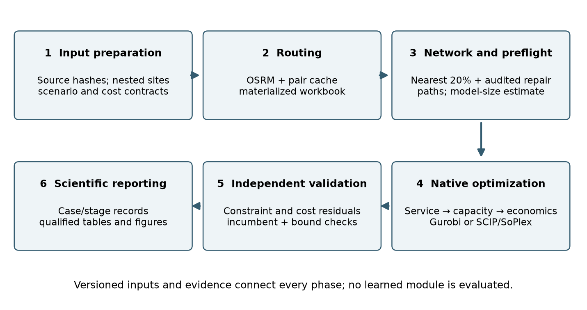
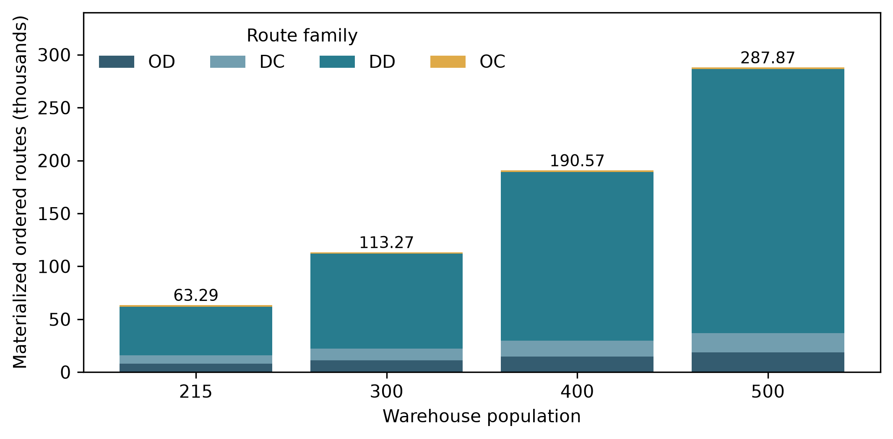

# Introduction

Post-harvest logistics poses a computational problem as well as an agricultural
planning problem. Adding candidate warehouses enlarges both the discrete
investment space and the potential interwarehouse network. Products, periods and
uncertainty scenarios then replicate continuous flow and inventory decisions.
An executable formulation can consequently exceed practical construction,
memory or optimization budgets long before its mathematical specification
becomes difficult to write. The relevant research problem is how to construct,
execute and validate these large models without hiding changes to the network,
decision criterion or quality of the returned solution.

Grain-storage investment is simultaneously a location problem and a network
planning problem. A storage facility connects seasonal arrivals to consumption
and export outlets, while its static capacity and handling throughput constrain
different activities. A building with sufficient stock capacity may still be
unable to receive a harvest peak. Conversely, more reception throughput cannot
create an outlet for supply when the selected network is disconnected.

The literature provides complementary perspectives on these decisions.
@foulds2005 develops dynamic network-flow models for grain-silo location.
@dubke2011 study specialized terminals in Brazilian soybean exports, and
@steiner2017 examine a multi-objective approach to silo location in Paraná.
The review by @rosa2025 motivates integrating storage-location decisions with
uncertainty and heterogeneous warehouse and grain characteristics. These works
establish the application context, while computational work on agricultural
optimization and simulation demonstrates the need to distinguish algorithmic
decomposition, data preparation and distributed execution [@shastri2011;
@zhao2012; @knapen2025].

The mathematical and decision-support starting point is the doctoral thesis
of Artur Guerra Rosa, *Modelagem matemática e sistemas de apoio à decisão para
a logística de alocação e armazenagem de grãos no Brasil* [@rosa2026thesis].
The present model is inspired by that grain-allocation and storage-planning
foundation and revises its feasibility relaxation, decision priorities and
network construction for resource-bounded HPC experiments. A bounded
thesis-method reconstruction is distinguished from the extended policy model
with separate slacks, service priorities and expanded candidate data. The published review
@rosa2025 and the doctoral thesis are distinct contributions and are cited
separately.

Model Agrologistic investigates a computational workflow built around this
foundation. Its objectives are to make model growth and resource consumption
measurable; preserve the meaning of network and feasibility transformations;
and independently validate selected deterministic and stochastic results on an
HPC platform. The unit of evaluation is the complete, versioned experiment,
not only the final objective value. Public-investment interpretation supplies
the application motivation, but the principal contribution assessed here is
the software and experimental method that produces a qualified result.

# Related work and research positioning

## Grain-storage planning as an integrated decision problem

The systematic review by @rosa2025 places grain-warehouse location within a
broader family of mathematical planning models. Complementarily, @garima2024
organize grain supply-chain decision research around operational complexity,
risk, infrastructure, stakeholders and solution methods. Together, these
perspectives show why adding sites to a location model is insufficient: a
strategic design must connect storage, seasonal handling and access to markets.
The following synthesis compares published approaches along these substantive
dimensions. [Appendix A](https://unb-lamfo-or-ai-hpc.github.io/model-agrologistic/supplementary-review.html)
provides the search strategy, selection record and
structured extraction for nine agricultural network-design studies.

Integrated wheat-network design in @gholamian2017 links infrastructure choices
to the organization of the supply chain. Scenario-based wheat planning in
@pourmohammadi2020 and sustainable, resilient network design in
@hosseini2020 extend this perspective to uncertain conditions and competing
performance concerns. These contributions motivate an integrated treatment,
but their commodity systems, constraints and objectives cannot be transferred
unchanged to a Brazilian grain-storage network. In particular, resilience to
disruption, seasonal variation and a numerical relaxation of capacity are
different concepts. A slack preserves a mathematical solution; it does not by
itself provide the transport, temporary equipment or institutional arrangements
that would make the physical network resilient.

Decision support also extends beyond optimization. @essien2018 address
sustainable multi-stakeholder grain storage, while @filippi2022 examine the
collective-action arrangements of rural warehouse condominiums. These studies
locate implementation within governance and stakeholder coordination. For a
public planning tool, candidate opening is therefore interpreted as an option
for appraisal, rather than a decision that can be executed without land,
financing, operating agreements or coordination among producers.

## Network representation and decision horizons

The foundational dynamic-network perspective connects storage investment to
flows across time rather than treating a silo solely as a point on a map
[@foulds2005]. In a Brazilian soybean setting, @mascarenhas2014 study
warehousing location with road and intermodal export connections. The
distinction is consequential: a throughput facility that transfers arrivals
onward is not interchangeable with a warehouse that carries inventory between
months. Static stock capacity, annual throughput and vehicle capacity must
therefore remain separate dimensions in a benchmark.

The logistics-integration-center formulation of @guimaraes2017 preserves
origin-destination demand relationships. By contrast, the present model
conserves each product but does not retain an origin label after it enters a
warehouse. Product from different origins can satisfy the same customer's
demand. This assumption is appropriate for a fungible-commodity planning
abstraction, but not for tracing contracts, quality lots or individual consignments.
It is a substantive difference in the feasible set, not simply a change of indices.

Terminal siting in @morais2023 connects location, capacity choices and
access to railways or waterways. @milanez2026 integrate soybean export
network design with hub functions and economies of scale. These studies
motivate reporting storage and transport decisions jointly. Nevertheless,
the present OSRM road matrix does not implement a multimodal assignment model.
A port destination is an export outlet, not an explicit maritime voyage; a
road segment near a railway does not create a rail arc.

@tbl-literature summarizes the selected studies and the modeling distinctions
that determine whether their results are comparable.

| Study | Network and decision emphasis | Comparison implication |
|:--|:--|:--|
| @foulds2005 | Dynamic grain-silo location and flow | Separate network size, capacity decisions and temporal flow |
| @mascarenhas2014 | Mato Grosso soybean warehouses and export connections | Distinguish throughput facilities from stock-carrying warehouses |
| @guimaraes2017 | Logistics integration centers and peer-to-peer demand | Commodity mixing differs from origin-destination preservation |
| @morais2023 | Capacitated terminals with intermodal location preferences | Modal access is not equivalent to a road-distance proxy |
| @milanez2026 | Hub location and soybean-export network design | Report hub function, capacity and route use together |
| @granillo2019 | Contract-farming network with simulation and MILP | Simulation-based uncertainty is not automatically two-stage recourse |
| @mendoza2021 | Scenario-based agro-food facility location | State which decisions precede the uncertain outcome |
| @vazquez2021 | Guayule/guar supply-chain design with sustainability criteria | Processing yields and sustainability constraints change comparability |
| @mogale2020 | Multi-echelon grain network with risk and losses | Losses and discrete transport resources require additional balances |

: Selected agricultural network-design studies and their implications for
comparability. The studies address different commodities and decision scopes. {#tbl-literature}

## Parameters, decisions and objective functions

Economic formulations typically connect fixed facility choices to continuous
material flows. The opening variable controls whether infrastructure can be
used, while installed capacity determines how much can be stored or handled.
A benchmark must distinguish a fixed-size site choice from scalable capacity:
both may contain a binary opening variable, but their investment feasible
sets differ. Counting producing regions or candidate sites is not an integer
decision variable unless the optimizer actually selects that count.

Agricultural models also differ in the economic boundary. Freight and
construction alone do not represent the same objective as freight, inventory,
processing, emissions, losses and employment. @mogale2020 include risk and
post-harvest losses in a green food supply-chain design. @vazquez2021 connect
supply-chain design to environmental and social impacts; @mogale2023 examine
social sustainability. Those dimensions are relevant to public planning but
are not current outputs of Model Agrologistic. We report neither avoided
emissions nor jobs created from a reduction in transport distance alone.

The cost evidence available to the present study is strongest at the
capacity-unit level. Introducing an arbitrary fixed construction charge on
top of a whole-project cost per tonne would risk counting part of the project
twice. Conversely, registry placeholders equal to zero do not establish that
investment is free. The data translation must state whether a quoted total
cost is represented by a fixed term, a capacity-proportional term, or a
documented decomposition. Sensitivity to uncertain investment costs is a
future economic analysis, not something to conceal through a large shortage
penalty.

Brazilian logistics costs also depend on more than distance. @kussano2012
analyze soybean export logistics using a broader cost accounting boundary,
including factors that can alter the ranking of modal alternatives. Accordingly,
OSRM distances in this study are inputs to a declared freight approximation,
not observed generalized logistics costs. Congestion, taxes, service contracts
and seasonally changing tariffs remain possible sources of divergence between
the least-cost modeled route and actual grain movements.

Spatial suitability and network optimization are complementary rather than
substitutable. @souza2024 use spatial multicriteria analysis for agricultural
warehouse location; such screening can constrain the candidate set before a
flow model allocates capacity. The present candidate population preserves
geographic and facility-type diversity but does not replace environmental,
land-use or engineering suitability assessment. Similarly, the wider
agricultural and carbon implications of Brazilian transport infrastructure
examined by @wang2024 lie outside a freight-and-storage objective. A shorter
modeled route cannot be interpreted automatically as a net environmental gain.

## Uncertainty and strategic interpretation

Uncertainty can enter a model through simulation, scenarios, robust
constraints or probabilistic objectives. These approaches answer different
questions. @granillo2019 combine a deterministic optimization model with
simulation in a barley contract-farming network. @mendoza2021 study
scenario-based facility location, while the adoption scenarios in
@vazquez2021 concern a different source of uncertainty. They should not be
classified as interchangeable simply because each uses multiple scenarios.

For soybean tactical planning, @reis2023 adopt a two-stage stochastic linear
program with first-stage purchasing and contracted transport. Our first stage
instead concerns long-lived warehouse decisions. The monetary gains in the
tactical study cannot serve as numerical validation of a strategic investment
model. Likewise, disruption and emergency-hub decisions in @maiyar2019 are
distinct from an emergency *slack*: the former represents a modeled physical
option, while the latter measures violation of nominal capacity.

Integrated decision support links planning horizons rather than treating
optimization in isolation [@mardaneh2021]. The joint crop-establishment,
harvesting and network-design perspective of @anselmino2025 provides another
example, in bioenergy rather than grain storage. Such work motivates clear
interfaces between data preparation, strategic investment and operational
evaluation. It does not imply that harvest scheduling or crop establishment
has been implemented in this demonstrator.

## Computational approaches in agricultural systems

@shastri2011 address a large agricultural optimization model through a
decomposition and distributed-computing approach to BioFeed, a biomass supply
planning problem. This is direct precedent for treating computational solution
strategy, rather than the use of a commercial optimizer alone, as a research
contribution. Our current extensive-form implementation does not reproduce
their decomposition or establish superiority over it.

@knapen2025 use standard big-data and distributed-computing technologies for
scalable crop-growth simulations. Their application illustrates a different
parallelization opportunity: distributing simulation work is not equivalent to
solving a MILP whose scenarios share first-stage integer decisions. @zhao2012
study parallelization and optimization of spatial analysis for environmental
model-data assembly. This distinction supports measuring data preparation
separately from the numerical solver rather than attributing all elapsed time
to optimization.

Shared-memory performance also requires explicit measurement. The PaScal Suite
of @silva2025pascal provides tools for evaluating and profiling parallel
scalability. Work on parallel dual revised simplex by @huangfu2018 shows that
parallelism may be organized within and across iterations. These references
motivate region-level timings and controlled thread-count experiments; they
do not imply that PaScal is integrated here or identify Gurobi's proprietary
internal algorithms.

@tbl-computational-literature relates the agricultural planning problem to
computational approaches at the optimization, simulation and data-processing
levels.

| Computational layer | Published precedent | Present implementation and evidence boundary |
|:--|:--|:--|
| Agricultural MILP solution strategy | @shastri2011 | Native Gurobi and SCIP extensive forms; decomposition is future work |
| Distributed agricultural simulation | @knapen2025 | Slurm experiment scheduling, not a distributed scenario solver |
| Spatial data preparation | @zhao2012 | Versioned OSRM materialization and pair-cache reuse; no matched speedup benchmark |
| Shared-memory profiling | @silva2025pascal | Separate workflow timings; controlled thread-scaling study remains open |
| LP parallel algorithms | @huangfu2018 | Solver method and thread settings recorded, without claims about proprietary internals |

: Computational precedents and the boundaries of the present contribution.
These studies address different workloads and are not runtime baselines for
the present instances. {#tbl-computational-literature}

## Research gap and contribution

The research gap concerns the computational scale at which a strategically
meaningful grain-storage network can be solved and its solution quality
verified. Agricultural location models establish the planning foundations,
whereas decomposition, distributed simulation and profiling studies identify
different computational opportunities. Connecting these perspectives requires
preserving the investment and service decisions while making network reduction,
scenario growth and resource limits measurable.

Building on @rosa2026thesis, the proposed model revises capacity relaxation
and decision priorities and is coupled to a high-performance implementation.
Its contributions are a dimensionally explicit service-first formulation;
a road-based, connectivity-preserving network-construction procedure; and an
experimental pipeline that separates workflow phases and validates decisions
independently of the optimizer. Their combined evaluation addresses the
interaction of model size, computational resources and certified planning
outcomes rather than treating a solver's termination status as the sole result.

The study addresses three research questions:

1. How do network size and scenario replication translate into variable counts,
   memory requirements and optimization time?
2. At which objective stages do computational bottlenecks arise, and what do
   the reported presolve and termination diagnostics reveal about the roles of
   discrete investment decisions, continuous recourse and capacity relaxation?
3. Which tested instances satisfy independent feasibility checks and the
   declared per-stage optimality criteria within eight hours on a single node,
   and how do their outcomes vary across the recorded solver profiles?

Structural counts describe scenario replication; the enlarged-network solver
comparison holds the scenario count at nine. Profile comparisons are
descriptive rather than repeated-trial estimates of stability or causal
performance effects. The evidence does not resolve the complete population
frontier or isolate the contribution of each formulation component.

# Materials and methods

## Planning problem and notation

The network links grain-producing regions to domestic customers and export
outlets through existing and candidate warehouses. Strategic decisions concern
candidate installation, storage expansion and conversion to bulk handling.
Operational decisions allocate each product across transport routes and time,
subject to stock, reception and shipping limits. Existing facilities are
available throughout the planning horizon; candidate availability depends on
investment. Export outlets absorb supply up to their declared limits.

The formulation builds on the allocation and storage structure of
@rosa2026thesis and introduces separate capacity-violation variables, an
explicit service-first objective hierarchy and connectivity-preserving network
selection. Supply is exogenous and must be allocated. Products are fungible
within their respective balances, but cannot substitute for one another.
Transport occurs within a planning period. Production scheduling, shipment
lead times, quality deterioration and fleet assignment are outside the model.

@tbl-sets defines the indices and eligible sets. Each arc set is
product-specific and fixed before optimization; a missing arc has no variable.
Domestic and export roles are distinct even when they share a municipality.
Direct transport is disabled by setting $A^{OC}=\varnothing$.

| Symbol | Definition |
|:--|:--|
| $o\in O$ | Supply origins |
| $w,v\in W$ | Sending and receiving warehouses |
| $W^E,W^N$ | Existing and candidate sites; a disjoint partition of $W$ |
| $W^X,W^B$ | Sites eligible for expansion and bulk-handling conversion |
| $c\in C^D,C^X$ | Domestic and export customer roles |
| $p\in P$ | Products |
| $t\in T=\{1,\ldots,H\}$ | Ordered planning periods |
| $s\in S$ | Uncertainty scenarios |
| $A^{OD},A^{DC},A^{DD},A^{OC}$ | Origin–warehouse, warehouse–customer, interwarehouse and direct arcs |

: Indices and sets. {#tbl-sets}

@tbl-parameters gives the coefficients and their physical dimensions. The
experiments use monthly periods, with $d_t=30$ operating days per period.
Candidate base capacities are zero. Bulk-handling conversion increases
throughput rather than stock capacity. Monetary coefficients share the input
currency basis; the objective is undiscounted.

| Symbol | Definition and unit |
|:--|:--|
| $a_{opt},D_{cpt},\overline E_{cpt}$ | Supply, domestic demand and export limit; tonnes per period |
| $I^0_{wp}$ | Initial inventory; tonnes |
| $K^0_w$ | Existing static capacity; tonnes |
| $R^0_w,H^0_w$ | Existing reception and shipping rates; tonnes/day |
| $d_t$ | Operating days in period $t$ |
| $\overline k_w,\overline e_w,\overline b_w$ | Candidate, expansion and handling-investment bounds; tonnes on the declared investment basis |
| $\rho^N,\rho^X,\rho^B;\ \eta^N,\eta^X,\eta^B$ | Reception and shipping gains per investment tonne; day$^{-1}$ |
| $\ell^{OD}_{ow},\ell^{DC}_{wc},\ell^{DD}_{wv},\ell^{OC}_{oc}$ | Directed road distances; km |
| $f^O_o,f^W_w$ | Origin and warehouse freight rates; currency/(tonne km) |
| $\tau_w,h_{wp}$ | Receiving handling charge, currency/tonne; inventory charge, currency/(tonne period) |
| $\alpha$ | Interwarehouse freight multiplier |
| $F^N_w,F^X_w,F^B_w$ | Fixed installation, expansion and handling-conversion costs; currency |
| $c^N_w,c^X_w,c^B_w$ | Variable investment costs; currency/investment tonne |
| $\lambda^D_{cp},\lambda^K_w,\lambda^R_w$ | Shortage and separate capacity-violation penalty rates; currency per corresponding tonne-based constraint quantity |
| $\pi_s$ | Scenario probability; positive, with $\sum_s\pi_s=1$ |

: Model parameters. {#tbl-parameters}

The decision variables are summarized in @tbl-variables. For compact notation,
variables outside their eligibility sets equal zero. Warehouse availability is
the expression $A_w=1$ for $w\in W^E$ and $A_w=y_w$ for $w\in W^N$.
Let $X=(y,z,g,k,e,b)$ denote investment and $Y$ denote operational decisions.

| Symbol | Definition and domain |
|:--|:--|
| $y_w,\ w\in W^N$ | Binary candidate installation |
| $z_w,\ w\in W^X$ | Binary expansion activation |
| $g_w,\ w\in W^B$ | Binary bulk-handling conversion |
| $k_w,e_w,b_w$ | Nonnegative investment quantities; tonnes on the declared costing basis |
| $x^{OD}_{owpt},x^{DC}_{wcpt},x^{DD}_{wvpt},x^{OC}_{ocpt}$ | Nonnegative flows on eligible arcs; tonnes per period |
| $I_{wpt}$ | Nonnegative end-of-period inventory; tonnes |
| $u_{cpt},\ c\in C^D$ | Nonnegative unmet domestic demand; tonnes |
| $q^K_{wt}$ | Nonnegative stock-capacity exceedance; tonnes |
| $q^R_{wt}$ | Nonnegative reception overflow; tonnes handled in a period |

: Deterministic decision variables. {#tbl-variables}

## Deterministic model

The deterministic model minimizes infrastructure, transportation, handling,
inventory and feasibility-penalty costs:

$$
\min_{X,Y}\quad Z_D=C^{inv}(X)+C^{op}(Y)+P(Y).
$$ {#eq-det-objective}

$$
\begin{aligned}
C^{inv}(X)={}&\sum_{w\in W^N}(F^N_wy_w+c^N_wk_w)\\
&+\sum_{w\in W^X}(F^X_wz_w+c^X_we_w)
+\sum_{w\in W^B}(F^B_wg_w+c^B_wb_w).
\end{aligned}
$$ {#eq-investment-cost}

$$
\begin{aligned}
C^{op}(Y)={}&\sum_{t\in T}\sum_{(o,w,p)\in A^{OD}}
(f^O_o\ell^{OD}_{ow}+\tau_w)x^{OD}_{owpt}\\
&+\sum_{t\in T}\sum_{(w,c,p)\in A^{DC}}
f^W_w\ell^{DC}_{wc}x^{DC}_{wcpt}\\
&+\sum_{t\in T}\sum_{(w,v,p)\in A^{DD}}
(\alpha f^W_w\ell^{DD}_{wv}+\tau_v)x^{DD}_{wvpt}\\
&+\sum_{t\in T}\sum_{(o,c,p)\in A^{OC}}
f^O_o\ell^{OC}_{oc}x^{OC}_{ocpt}
+\sum_{w,p,t}h_{wp}I_{wpt}.
\end{aligned}
$$ {#eq-operating-cost}

$$
P(Y)=\sum_{c\in C^D,p,t}\lambda^D_{cp}u_{cpt}
+\sum_{w,t}(\lambda^K_wq^K_{wt}+\lambda^R_wq^R_{wt}).
$$ {#eq-penalty}

The model is subject to investment activation, material balance, service and
warehouse-capacity restrictions:

$$
0\le k_w\le\overline k_w y_w
\qquad \forall w\in W^N.
$$ {#eq-candidate}

$$
\begin{aligned}
0\le e_w&\le\overline e_wz_w,\quad z_w\le A_w
&&\forall w\in W^X,\\
0\le b_w&\le\overline b_wg_w,\quad g_w\le A_w
&&\forall w\in W^B,\\
z_w+g_w&\le A_w &&\forall w\in W^X\cap W^B.
\end{aligned}
$$ {#eq-investment}

$$
\begin{aligned}
K_w(X)&=K^0_w+k_w+e_w,\\
R_w(X)&=R^0_w+\rho^Nk_w+\rho^Xe_w+\rho^Bb_w,\\
H_w(X)&=H^0_w+\eta^Nk_w+\eta^Xe_w+\eta^Bb_w
\qquad \forall w\in W.
\end{aligned}
$$ {#eq-nominal}

$$
\sum_{w:(o,w,p)\in A^{OD}}x^{OD}_{owpt}
+\sum_{c:(o,c,p)\in A^{OC}}x^{OC}_{ocpt}=a_{opt}
\qquad \forall o,p,t.
$$ {#eq-supply}

$$
\begin{aligned}
B^{in}_{wpt}&=\sum_{o:(o,w,p)\in A^{OD}}x^{OD}_{owpt}
+\sum_{v:(v,w,p)\in A^{DD}}x^{DD}_{vwpt},\\
B^{out}_{wpt}&=\sum_{c:(w,c,p)\in A^{DC}}x^{DC}_{wcpt}
+\sum_{v:(w,v,p)\in A^{DD}}x^{DD}_{wvpt}
\qquad \forall w,p,t.
\end{aligned}
$$ {#eq-inout}

$$
I_{wpt}=I_{wp,t-1}+B^{in}_{wpt}-B^{out}_{wpt},
\quad I_{wp,0}=I^0_{wp}
\qquad \forall w,p,t.
$$ {#eq-inventory}

$$
\sum_{w:(w,c,p)\in A^{DC}}x^{DC}_{wcpt}
+\sum_{o:(o,c,p)\in A^{OC}}x^{OC}_{ocpt}+u_{cpt}=D_{cpt}
\qquad \forall c\in C^D,p,t.
$$ {#eq-service}

$$
\sum_{w:(w,c,p)\in A^{DC}}x^{DC}_{wcpt}
+\sum_{o:(o,c,p)\in A^{OC}}x^{OC}_{ocpt}\le\overline E_{cpt}
\qquad \forall c\in C^X,p,t.
$$ {#eq-export}

$$
\sum_{p\in P}I_{wpt}\le K_w(X)+q^K_{wt}
\qquad \forall w,t.
$$ {#eq-static}

$$
\sum_{p\in P}B^{in}_{wpt}\le d_tR_w(X)+q^R_{wt}
\qquad \forall w,t.
$$ {#eq-reception}

$$
\sum_{p\in P}B^{out}_{wpt}\le d_tH_w(X)
\qquad \forall w,t.
$$ {#eq-shipping}

$$
y_w=0\ \Longrightarrow\ q^K_{wt}=q^R_{wt}=0
\qquad \forall w\in W^N,t\in T.
$$ {#eq-indicator}

$$
y_w,z_w,g_w\in\{0,1\},\qquad k_w,e_w,b_w,x,I,u,q^K,q^R\ge0
\quad \text{on their respective eligible index sets}.
$$ {#eq-domains}

@eq-investment-cost charges each investment once. The four transport terms
in @eq-operating-cost distinguish origin–warehouse, warehouse–customer,
interwarehouse and direct movements. Receiving handling is charged at the
destination warehouse; $\alpha$ discounts or increases interwarehouse freight,
not handling. Inventory costs apply to each period's ending stock.
@eq-penalty exposes violations in the scalar reference model. Its
thesis-derived penalty calibration is a feasibility device rather than an
estimate of social damage.

@eq-candidate and @eq-investment link quantities to activation and prevent
simultaneous expansion and bulk-handling conversion where both options exist.
@eq-nominal distinguishes stock capacity from daily handling rates.
@eq-supply allocates all production, while @eq-inventory conserves grain
separately at every warehouse, product and period using the expressions in
@eq-inout. @eq-service accounts for domestic shortage; @eq-export treats
exports as bounded outlets rather than mandatory demand or sales revenue.

@eq-static–@eq-shipping impose capacities shared across products.
Reception overflow is added after converting daily reception into a period
quantity. Consequently, $q^R_{wt}$ is measured in tonnes and its daily
equivalent is $q^R_{wt}/d_t$; multiplying it by $d_t$ again would be
dimensionally inappropriate. Shipping remains a hard restriction.
@eq-indicator prevents unopened candidates from using emergency capacity.
The implementation uses native indicator constraints; an equivalent
big-$M$ inequality would require a separately derived valid upper bound,
rather than an arbitrary constant. The domains in @eq-domains complete the
formulation. Terminal inventory remains free within the balance and capacity
constraints, with no salvage value.

Independent validation evaluates every indexed balance and capacity
restriction, including activation and reconstructed costs. An aggregate
material balance is an additional diagnostic, not a substitute for local
checks, because positive and negative residuals could cancel.

## Two-stage stochastic model

Infrastructure $X$ is selected before uncertainty is observed. After scenario
$s$ is realized, its entire supply and demand trajectory becomes available to
the operational recourse decisions
$Y^s=(x^s,I^s,u^s,q^{K,s},q^{R,s})$. This information structure is
two-stage: investments are common across scenarios, while operations can
respond to the realized trajectory. It does not model progressive revelation
within the planning horizon.

The deterministic equivalent minimizes first-stage investment and expected
operating and feasibility-penalty costs:

$$
\min_{X,\{Y^s\}_{s\in S}}\quad
Z_{RP}=C^{inv}(X)+\sum_{s\in S}\pi_s[C^{op}(Y^s)+P(Y^s)].
$$ {#eq-rp}

Investment restrictions @eq-candidate–@eq-nominal and the binary domains
apply once. For every scenario, the operational system is

$$
\sum_{w:(o,w,p)\in A^{OD}}x^{OD,s}_{owpt}
+\sum_{c:(o,c,p)\in A^{OC}}x^{OC,s}_{ocpt}=a^s_{opt}
\qquad \forall o,p,t,s.
$$ {#eq-sto-supply}

$$
I^s_{wpt}=I^s_{wp,t-1}+B^{in,s}_{wpt}-B^{out,s}_{wpt},
\quad I^s_{wp,0}=I^0_{wp}
\qquad \forall w,p,t,s.
$$ {#eq-sto-inventory}

$$
\sum_{w:(w,c,p)\in A^{DC}}x^{DC,s}_{wcpt}
+\sum_{o:(o,c,p)\in A^{OC}}x^{OC,s}_{ocpt}+u^s_{cpt}=D^s_{cpt}
\qquad \forall c\in C^D,p,t,s.
$$ {#eq-sto-domestic}

$$
\sum_{w:(w,c,p)\in A^{DC}}x^{DC,s}_{wcpt}
+\sum_{o:(o,c,p)\in A^{OC}}x^{OC,s}_{ocpt}\le\overline E^s_{cpt}
\qquad \forall c\in C^X,p,t,s.
$$ {#eq-sto-export}

$$
\begin{aligned}
\sum_p I^s_{wpt}&\le K_w(X)+q^{K,s}_{wt},\\
\sum_p B^{in,s}_{wpt}&\le d_tR_w(X)+q^{R,s}_{wt},\\
\sum_p B^{out,s}_{wpt}&\le d_tH_w(X)
\qquad \forall w,t,s.
\end{aligned}
$$ {#eq-sto-capacity}

$$
y_w=0\ \Longrightarrow\ q^{K,s}_{wt}=q^{R,s}_{wt}=0
\qquad \forall w\in W^N,t,s;\qquad Y^s\ge0\quad\forall s.
$$ {#eq-sto-domains}

The inflow and outflow expressions retain the eligible arc restrictions of
@eq-inout with scenario-indexed flows. Common investments enforce
nonanticipativity without replicated investment variables. Probabilities
weight costs, not physical constraints. Initial inventory, route selection,
road distances and investment coefficients remain common across scenarios.
Missing paths, closed facilities or restrictive shipping can still make
recourse infeasible; separate slacks do not imply complete recourse for
arbitrary data.

## Service-first planning policy

A capacity relaxation based on one shared variable is different from separate
variables: under a common penalty $\lambda$, fixed exceedances $a,b\ge0$
produce $\lambda\max(a,b)$ with a shared slack and $\lambda(a+b)$ with separate
slacks. The present formulation therefore revises the relaxation inherited
from @rosa2026thesis rather than reproducing its objective numerically.

For the policy experiments, the physical constraints are retained and scalar
penalization is replaced by a three-priority hierarchy:

$$
U=\sum_s\pi_s\sum_{c\in C^D,p,t}u^s_{cpt},
\qquad
V=\sum_s\pi_s\sum_{w,t}(q^{K,s}_{wt}+q^{R,s}_{wt}).
$$ {#eq-policy-scores}

$$
\operatorname{lexmin}\left(
U,\ V,\ C^{inv}(X)+\sum_s\pi_s C^{op}(Y^s)\right).
$$ {#eq-hierarchy}

The first pass minimizes domestic shortage, the second minimizes a
capacity-violation score, and the third minimizes economic cost. The
deterministic specialization has a single scenario. Although both components
of $V$ are tonne-based constraint quantities, one sums stock exceedances
over periods and the other sums throughput exceedances. Their equal-weight
aggregation expresses a policy preference, not installed capacity. Component
totals and daily reception equivalents are therefore reported separately.

The hierarchy is implemented with declared optimality and priority-degradation
tolerances. Final decisions may increase an earlier pass's objective within
its inherited allowance. Pass-end scores, final scores, bounds and attained
gaps are retained together. Completion requires all three passes and
independent feasibility validation; service attainment alone is insufficient.

## Data lineage and network construction

The study separates the historical benchmark source pool, a normalized bounded
instance, and an expanded canonical workbook. Duplicate-key normalization
preserves material totals; candidate translation distinguishes registry
placeholders from genuine investment costs. The policy reference contains 215
warehouses, comprising 146 existing facilities and 69 candidates. A nested
sequence contains 300, 400 and 500 warehouses, with 146 existing facilities
preserved in each population. Optimization was evaluated at 215, 300 and 400;
materialization at 500 is not evidence of an optimized 500-warehouse instance.

OSRM v6.0.0, the driving profile, MLD preprocessing and the dated
`brazil-260901` extract define the road-distance authority. Distances are
materialized before optimization; the solver never queries a live routing
service. The Table service returns distance along the profile-selected fastest
route, which is not necessarily the shortest-distance road path. Ordered
coordinate pairs, dataset/profile identity and query policy identify cached
entries. Routing failures do not silently become straight-line distances.
Only declared no-route or excessive-snap cases admit audited Haversine fallback.
The materialized 215, 300, 400 and 500 populations required no fallback.

The historical grouped rule retains the nearest ceiling 20 percent of eligible
edges per sending-node/product group. It is a sparsification rule, not a proof
of Pareto optimality. The policy profile adds explicit connectivity repairs
from eligible routes when required; added edges are reported separately. Direct
origin-to-customer arcs form a controlled on/off factor. Interwarehouse freight
uses a separate interhub factor, $\alpha$. Physical routing coverage and
post-filter customer reachability are different diagnostics.

The present OSM snapshot and the unreconstructed forecasting path differ from
the thesis inputs. Accordingly, the correct claim is a bounded **thesis-method
comparison with separate slacks**, followed by a policy extension. Exact
replication of published thesis cost tables is not an acceptance criterion.

## Multi-hop interwarehouse connectivity and computational pipeline

For each sending warehouse and product, the baseline retains the nearest
$\lceil0.2(|W|-1)\rceil$ eligible directed interwarehouse arcs. The algorithm
then audits strong connectivity and, where necessary, adds explicitly recorded
eligible repair edges. The final retained fraction includes both rounding and
repairs. Multi-hop paths need not be direct edges, and a strongly connected
candidate graph does not guarantee that the subset of opened warehouses has
sufficient capacity. Both distinctions are checked separately from road routing.

The retained fractions in the tested networks were approximately 20.09%, 20.07%
and 20.05% for 215, 300 and 400 warehouses, respectively, for each product.
The recorded repair counts were zero. The excess over 20% therefore reflects
integer rounding rather than undocumented additional routes. The connectivity
audit, component membership, repair-edge list and path summary preserve the
network-construction evidence.

@fig-pipeline separates preparation from optimization and subsequent validation.

{#fig-pipeline}

The phases in @fig-pipeline produce, respectively, source/population manifests;
OSRM workbooks, cache and provenance audits; scenario, size and connectivity
reports; native logs and stage bounds; independent constraint and cost checks;
and versioned tables and figures. An immutable experiment definition links the
phases. Scenario construction is an experimental input transformation, not
offline machine-learning training. Predictive accuracy, forecast calibration
and learned solver guidance are outside the evaluated pipeline.

## Experimental and validation protocol

The selected reference design is deliberately smaller than the available
factorial configuration space. @tbl-design describes the comparison
without exposing internal gate numbers as scientific treatment labels.

| Profile | Scenarios | Direct arcs | Interpretation |
|:--|:--|:--|:--|
| Bounded thesis-method | 1 and 3 | Off / on | $\alpha=0.8$, grouped 20 percent, separate slacks |
| Policy, 215 warehouses | 1, 3 and 9 | Off / on | Service-first, 20 percent plus connectivity repair |

: Selected reference design: four thesis-method and six policy executions. {#tbl-design}

The coupled three-scenario thesis profile uses probabilities 0.33, 0.34 and
0.33 with low, central and high supply/demand factors. Policy scenarios are
defined in separate versioned manifests; their design is not an empirical
probability forecast. Three versus nine scenarios therefore compares specified
experimental distributions, not a statistical convergence guarantee.

The initial references provide a historical validation baseline. The subsequent
nine-scenario experiment evaluates native Gurobi and SCIP/SoPlex implementations
under a nominal 28,800-second global optimization budget and a 10% relative-gap
target for the capacity and economic passes. The service target uses an absolute
zero-within-tolerance certificate; a relative gap at a zero objective is not
informative. All three priorities must finish, and an independent incumbent
validation must pass, before an attempt is classified as quality-certified.

The comparison contains seven Gurobi attempts at 215, 300 and 400 warehouses
and six SCIP attempts at 215 and 300. Each population has warehouse-only and
direct-enabled treatments. A separately identified Gurobi warehouse-300
all-barrier repeat and two SCIP enlarged-memory repeats are retained alongside
their predecessors. These are treatment attempts, not statistical replicates.
The 400-warehouse SCIP cases reached input preflight only and are excluded from
the solve denominator. No 500-warehouse optimization is reported.

The nine scenarios are the Cartesian product of three supply and three demand
levels, with two products and 60 periods. First-stage investment decisions
are shared. Network settings, the 30-day capacity convention and scenario
summaries were reconciled between solver records. Native SCIP support covers
the stochastic hierarchy; deterministic SCIP, SCIP EVPI/VSS and SCIP IIS are
not evaluated. Small analytical and licensed parity tests establish a separate
software-qualification layer, not a guarantee of large-instance convergence.

Gurobi uses its hierarchical objectives and pass-specific environments.
The historical automatic profile leaves the root method at its default;
the all-barrier profile explicitly selects barrier for all priorities.
SCIP/SoPlex executes sequential objectives with explicit inherited-priority
constraints and a shared remaining-time budget. The recorded build does not
implement the Gurobi all-barrier profile. Both backends report native and
common bound conventions rather than assuming identically named gaps have
identical definitions. Relative MIP tolerance also enters Gurobi's inherited
base value: zero explicit objective-relative tolerance alone does not imply
that a later pass cannot degrade the previous incumbent.

Validation has four levels: mathematical/data contracts; software and licensed
analytical tests; independent solution validation; and the selected HPC
demonstration. Acceptance requires matching implementation, runtime, data and
configuration identities. Old evidence remains attached to its original
identity even when later source changes are only documentation changes.

Data reading, backend construction and `model.optimize()` have separate clocks.
Post-optimality computations for stochastic-value analysis require additional
solves and must be reported separately from primary optimization. Slurm elapsed
time includes orchestration and must not substitute for the optimizer clock.
An end-to-end reporting table must distinguish these intervals and disclose
cache reuse rather than adding overlapping measurements.

## Value of information and stochasticity

Following the two-stage recourse interpretation of @birge2011, for comparable
minimization problems on the same frozen scalar objective,

$$
EVPI=Z_{RP}-Z_{WS},\qquad VSS=Z_{EEV}-Z_{RP}.
$$ {#eq-values}

WS optimizes first-stage decisions independently by scenario; EEV evaluates the
expected-value investment plan in the stochastic environment. Both metrics
require additional optimization and component-level cost accounting. A large
penalty-driven VSS is not a monetized economic benefit. Investment, operating
and penalty differences must be presented separately.

If $L$ and $U$ denote valid objective bounds and incumbent values, an EVPI
interval is $[L_{RP}-U_{WS},\ U_{RP}-L_{WS}]$; similarly a VSS interval is
$[L_{EEV}-U_{RP},\ U_{EEV}-L_{RP}]$. An interval crossing zero is numerically
indeterminate, not evidence of negative theoretical stochastic value. Classical
monetary EVPI/VSS is not automatically assigned to the service-first vector
objective in @eq-hierarchy.

## HPC experimental environment

Computational experiments were executed at the Núcleo de Processamento de Alto
Desempenho (NPAD), Federal University of Rio Grande do Norte (UFRN), Brazil,
under Slurm. The official infrastructure description lists Intel nodes with
two 16-core Xeon E5-2698 v3 processors at 2.3 GHz, DDR4 memory and InfiniBand
interconnects; the Intel partitions distinguish 128, 256 and 512 GB node-memory
classes [@npad2026]. Node specifications are distinct from the resources
allocated to an individual job. The later comparison configured four solver
threads and used CPU execution; no GPU acceleration is claimed. Gurobi 13.0.3
ran in the 256 GB node class with 192 GiB requested from Slurm and a 128 GB
internal soft-memory setting. Native SCIP 10.0.2 with SoPlex 8.0.2 and
PySCIPOpt 6.2.1 used a 131072 MB internal limit initially. Its enlarged-memory
300-warehouse repeats used 393216 MB and exclusive 512 GB-class nodes,
with 512000 MiB (500 GiB) reported scheduler allocation. These configured
internal limits are not process RSS ceilings or intrinsic solver maxima.

Scheduler accounting assigned 24 CPUs to the original SCIP jobs and 64 to
the enlarged-memory jobs, despite four configured solver threads. Allocated
CPU counts therefore do not establish the degree of solver parallelism.
Python 3.13.15 was used; the archived Gurobi and SCIP environments also differ
in NumPy version (2.5.2 and 2.5.3). The comparison is descriptive, not a
hardware- and runtime-controlled speedup benchmark.

The runtime and package versions, source identity, workbook hashes, experiment
parameters and license-dependent test outcomes are captured with each evidence
package. OSRM preprocessing is a separate workload from model construction and
optimization. Persistent pair caching avoids repeated routing requests; neither
cache retrieval nor road-network preprocessing is charged to `model.optimize()`.
Slurm completion records and process memory accounting supplement, but do not
replace, application-level timings and independent solution checks.

## Model size, memory and performance measurement

Let $n_W=|W|$ be the number of warehouses and let $\mathcal A_p$ denote the retained
directed arcs eligible for product $p$. The flow-variable count in an extensive
form with a common arc set across scenarios is
$|S||T|\sum_p|\mathcal A_p|$. Inventory adds terms proportional to
$|S||T||W||P|$; slacks and first-stage investment decisions add their own
separately counted blocks. These are structural counts, not a polynomial-time
complexity claim for the MILP. The preflight reports the count for the actual
instantiated index sets rather than assuming every theoretical arc exists.

Before screening, the directed interwarehouse graph contains at most
$n_W(n_W-1)$ arcs. Retaining a fixed fraction does not remove this quadratic growth.
Scenario replication enlarges the continuous relaxation and stored matrix,
whereas integer facility decisions influence the branch-and-bound search.
Neither variable count nor warehouse count alone predicts solution time:
connectivity, coefficient scaling, relaxation strength, degeneracy and the
objective hierarchy can change the search substantially.

The experimental unit is therefore a frozen input/configuration pair together
with its resource allocation. Reports separate data reading, backend model
construction, primary optimization, post-optimality analysis, validation and
export where available. Missing historical timings remain missing; they are
not reconstructed by subtracting overlapping clocks. For a service-first run,
stage-specific objective bounds, gaps and completion states accompany the
total optimizer time. For scalar EVPI/VSS analysis, auxiliary solves must not
be counted as a speed penalty of the primary RP solve.

Current jobs solve an extensive-form MILP within one allocated node; Slurm
arrays distribute independent experiments. This is not a distributed MILP
solver, and no multi-node speedup is claimed. A future strong-scaling test
would hold model, objective, stopping rules and hardware fixed while varying
threads, report repeated trials and compare $T_1/T_p$ and $(T_1/T_p)/p$.
Region-level profiling, as motivated by @silva2025pascal, can then distinguish
serial data preparation from solver work. Present memory and elapsed-time
observations establish resource requirements for selected cases, not parallel
efficiency estimates.

# Results

## Historical reference experiment

The initial deterministic and three-scenario validation established the
mathematical, software and independent-solution checks for eight selected
configurations. One of two nine-scenario references also completed the original
protocol. The final warehouse-only retry attained zero domestic shortage but
reached the 14,400-second budget with a 100% capacity-stage optimality gap;
its economic pass was not executed.
The original ten-reference report therefore remains rejected.
This earlier experiment motivated, but is not pooled with, the enlarged
28,800-second, 10%-gap comparison below. Its detailed stage tables and resource
figures are retained in the historical reference supplement.

## Network size and road-data preparation

The road inventory contains 63,289, 113,269, 190,569 and 287,869 ordered records
for 215, 300, 400 and 500 warehouses. These are pre-filter route records,
not the arcs retained by the MILP. Every reported record uses OSRM, with no
Haversine fallback. Coordinate-pair reuse reduces routing work without merging
distinct facilities. The integrity checks normalize small negative routing
artifacts under the documented numerical policy and preserve their audit counts.

@fig-routing-growth distinguishes the routing inventory from the optimization
experiment.

{#fig-routing-growth}

With nine scenarios and 60 periods, warehouse-only extensive forms contain
14,054,654, 25,107,544 and 42,106,944 estimated variables at 215, 300 and 400
warehouses. Enabling direct arcs adds 319,680 variables in each case.
The increase from 215 to 400 nearly triples model size despite retaining only
about one fifth of interwarehouse edges. Strong connectivity preserves paths,
but does not remove the quadratic arc-growth term.

## Solver outcomes and resource requirements



Four of seven Gurobi attempts completed the three-pass hierarchy at the
declared quality target. Both 215-warehouse route variants were accepted.
At 300 warehouses, the historical warehouse-only attempt reached an economic
gap of 50.52%, whereas its separately identified all-barrier repeat
completed with 0.08%. The direct-enabled attempt completed with a
0.07% economic gap. Its capacity-stage optimality gap was 1.29%: acceptable
under the 10% campaign rule, but not under a hypothetical 1% rule. A configured tolerance
must not be substituted for the attained gap.

At 400 warehouses, both all-barrier runs returned independently valid
incumbents but remained time-limited. The warehouse-only case stopped in
the capacity pass at 100%, without an economic pass. The direct-enabled case
completed capacity at 0.06% but stopped in economics at approximately 100%.
These final all-barrier outcomes are time limits, not the memory limits
observed during earlier mixed-method diagnostics. Reaching a feasible network
and certifying all objective priorities are different computational tasks.

All six SCIP attempts terminated without an incumbent. The 215-warehouse
cases exhausted the optimization budget in the first-stage solve. At 300,
the original 131072 MB internal-memory profile stopped during presolve.
Repeats with 393216 MB, larger node allocations and otherwise identified
inputs reached the time limit instead. Their peak application RSS was
approximately 154--155 GiB, below the enlarged configured budget.
The additional memory removed the early observed stop but did not yield a
solution. Because allocation and hardware also changed, this is not an isolated
estimate of the causal effect of memory.

The presolved first service-pass SCIP problem at 215 warehouses retained
approximately 12.45 million continuous variables and 394 thousand constraints
in the warehouse-only case. Removing discrete variables in that transformed
pass did not make its large LP inexpensive; nor does it imply that the
original investment hierarchy is a continuous optimization problem.
The later hierarchy still has to preserve investment and priority semantics.

## Service, capacity and economic interpretation

The capacity-stage optimality gap measures the separation between the
incumbent capacity-violation objective and its solver bound. It is not a
physical capacity shortfall. Stock exceedance and reception overflow are
reported separately in their respective physical units; the gap is a
dimensionless measure of optimization quality.

All quality-certified Gurobi cases attained domestic service within the
absolute certificate, including scenario-wise checks. Their positive capacity
violations show that service fulfillment is not a claim of nominal
infrastructure adequacy. The static score accumulates stock exceedance over
warehouse-periods; reception overflow measures material above period handling
limits. Neither their sum nor a large penalty total is an installed-capacity
recommendation.

The accepted economic costs in @tbl-economic-observations are conditional
model outputs, not observed expenditures. Within the accepted pairs, the
direct-enabled values are lower than the warehouse-only values, but the
capacity-priority limits inherited by their economic passes are not identical.
Consequently, their difference is not an identified benefit attributable solely
to direct arcs. It would require a controlled common-priority comparison,
followed by sensitivity to freight and investment assumptions, to interpret
a policy effect.

The distinction between pass and final scores is material. For the accepted
300-warehouse, warehouse-only all-barrier run, the capacity-pass score was
328,334,362.50, while the final economic solution used 360,354,208.20 within
the recorded inherited limit. This is permitted degradation under the chosen
hierarchy, not evidence that the capacity objective was minimized exactly.
Stage-level gaps and final decisions must therefore be read together.

## Evidence coverage and predictive scope

The comparative record reconciles eleven audit-declared campaign identities
and 81 supplied completion-bound artifact hashes. Eight cross-solver pairings
match exported workbook identifiers, model and loader settings, scenario
summaries, route counts and connectivity audits. This establishes agreement
of the supplied input records, not a new comparison of absent workbook bytes,
full coefficient matrices or complete solution vectors. The independent
feasibility results are the original archived validations.

No SCIP cost, service attainment or finite optimality gap is imputed when an
incumbent is absent. In particular, default service fields are not interpreted
as successful fulfillment. No predictive experiment is included: the scenario
levels are controlled realizations, not validated forecasts. Accordingly,
forecast accuracy, calibration gains and learned-policy benefits remain
unmeasured rather than being inferred from optimization outcomes.

# Discussion and limitations

## Computational scale and solution quality

The experiments answer the computational-scale question at two levels:
Gurobi produced independently feasible plans for all tested populations,
but completed the declared objective hierarchy only at 215 and 300 warehouses.
Thus, 300 is the largest quality-certified population tested under the
evaluated resource profiles. The 400-warehouse outcomes establish that
feasibility can remain attainable after economic certification becomes
computationally difficult. They locate an unresolved region of the
experiment, rather than a universal upper bound on network size.

Solver configuration affected which priority became limiting. At 300
warehouses, the all-barrier warehouse-only repeat completed the hierarchy,
whereas the earlier automatic-profile attempt remained uncertified.
At 400, the direct-enabled case completed the capacity pass but exhausted
the economic budget. These observations support stage-specific diagnostics:
a single elapsed time or service score would obscure the distinction.
The descriptive comparison does not identify a general barrier speedup,
because hardware-matched statistical repetitions were not performed.

SCIP's enlarged-memory repeats changed early presolve memory interruptions
into time-limit outcomes without producing incumbents. The 215-warehouse
service pass also retained a large continuous relaxation after presolve.
The practical obstacle therefore included solving a high-dimensional LP,
not only exploring integer facility choices. Additional memory addressed
one observed interruption mechanism but did not ensure progress through
the planning hierarchy. Missing incumbents prevent economic or service
comparisons with Gurobi; they do not demonstrate mathematical infeasibility.

## Modeling and agricultural interpretation

The revised model connects a service-first investment criterion to explicit
stock and throughput diagnostics. Building on @rosa2026thesis, separate
capacity variables and hierarchical priorities change the planning
formulation, while audited network construction changes the operational
alternatives available to it. The contribution is consequently a revised
planning model and an independently inspectable computational implementation,
not merely relocation of an unchanged program to a larger machine.

Positive emergency quantities in otherwise service-complete solutions
identify pressure on nominal infrastructure. Their interpretation must
respect time and activity: static exceedance accumulated across periods
is not an installed-capacity requirement, and reception overflow is not
daily throughput until divided by operating days. Candidate saturation,
peak location-period requirements and feasible alternative outlets should
inform engineering appraisal. This interpretation complements the
stakeholder and governance perspectives of @essien2018 and @filippi2022.

The capacity score and priority tolerances embody policy preferences.
They make the ordering of service, violations and economic cost explicit,
but affect the final infrastructure plan. Conditional cost differences
between direct-enabled and warehouse-only solutions consequently require
a common-priority sensitivity analysis before they can be attributed to
direct transport alone. Similar care applies to environmental and social
interpretation: freight reductions are not estimates of avoided emissions,
employment or welfare [@vazquez2021; @mogale2023; @wang2024].

## Scope of inference and data limitations

Nearest-distance screening reduces the feasible network. Strong-connectivity
repair preserves multi-hop paths but cannot restore every discarded route,
nor guarantee a connected, capacity-sufficient set of opened facilities.
OSRM's fastest driving route is a reproducible road-distance authority,
not a complete freight model. Heavy-vehicle restrictions, rail and
waterway services, congestion, contracts and seasonal tariffs require
additional representation [@kussano2012; @morais2023].

The scenario levels are controlled experimental realizations rather than
validated forecasts. Out-of-sample prediction, correlated shocks and
progressive information revelation remain outside the current evidence.
Scenario-wise service checks reduce the risk of concealing adverse
realizations behind an expectation, but do not establish reliability under
all agricultural uncertainty. Likewise, independent validation checks
the encoded model and exported decisions, not the realism of every
coefficient or the uniqueness of investments.

The historical road snapshot and forecasting path were not reconstructed;
thesis-method comparison is therefore bounded rather than exact numerical
replication. The cohort uses selected, identified profiles, without a
matched ablation of every pipeline component. Cache reuse and model-size
reduction demonstrate operational capabilities, not isolated causal
speedups [@shastri2011; @knapen2025]. These limitations define the next
controlled experiments without diminishing the distinction between
feasible plans, certified solutions and no-incumbent outcomes.

# Future work: computational scaling and decomposition

The next experiments should establish a controlled frontier rather than
assume that a single population threshold applies to every solver profile.
Nested intermediate populations, followed by networks above 500 warehouses,
would be evaluated with fixed scenario design, resource budgets, feasibility
criteria and attained gaps. Hardware-matched repeats and component ablations
would separate effects of network reduction, solver configuration and
data-cache reuse. Sensitivity to connectivity repair and retained edge
fractions is needed because strong connectivity guarantees paths, not
equivalence to the unrestricted network.

Benders decomposition is a candidate approach for separating shared
infrastructure decisions from scenario-specific continuous logistics
[@birge2011; @kaltis2026]. A master problem would choose investments and
scenario subproblems would evaluate their operating implications. The method
is not an implemented component of the present framework. Initial tests
should demonstrate agreement with the extensive formulation on small instances,
including feasibility cuts for obstructed recourse and valid linking
restrictions for candidate activation. A later extension would preserve
the service, capacity and economic priorities and their declared tolerances.
A time-limited master incumbent is not a lower bound; termination requires
a valid global bound and independently feasible recourse.

Decomposition does not remove all network growth. With a fixed retained
fraction, the number of potential interwarehouse arcs still grows
quadratically. Scenario parallelism may lower elapsed time while increasing
aggregate memory. Worker allocation, communication, cut accumulation and
subproblem memory should therefore accompany performance results. Expansion
toward the registry's approximately 18,000 sites is a long-term feasibility
question, not an extrapolation of the current certified 300-warehouse result.

An additional experiment should determine whether the two-stage model yields
different investment decisions or expected costs from a deterministic plan
evaluated under the same nine scenarios. It requires paired inputs, consistent
first-stage fixing, identical service and capacity priorities, and comparable
bound certification. The existing historical scalar value-of-information
results and separate policy runs do not establish that comparison for the
current service-first hierarchy.

The planning framework also requires economic and agricultural extensions:
updated freight and investment evidence, multimodal access, engineering
suitability, correlated scenarios and out-of-sample validation. Forecasting,
if incorporated, should be evaluated offline on held-out observations before
its predictions enter the solver. Predictive accuracy and downstream planning
performance would then be reported separately. A versioned repository deposit
of licensed inputs and key outputs would support these comparisons.

# Conclusions

Building on @rosa2026thesis, this study develops an HPC-aware workflow for
constructing, executing and independently checking grain-storage investment
models. Its computational focus is the interaction of network growth,
scenario replication, memory demand and solution-quality requirements.
Investigator-developed data, diagnostic and validation tools connect those
requirements to reproducible evidence rather than relying on solver status
alone. Service fulfillment, nominal capacity violations and economic cost
remain separately interpretable outputs.

The nine-scenario comparison retained thirteen attempts, including unsuccessful
configurations and their identified repeats. Four Gurobi attempts at 215 and
300 warehouses completed the hierarchy under the 10% criterion; the accepted
300-warehouse economic gaps were below 0.1%. Both 400-warehouse attempts produced
valid incumbents without complete quality certification. SCIP produced no
incumbent at 215 or 300, including the enlarged-memory repeats. Thus, 300 is
the largest quality-certified population tested with Gurobi, not a universal
network-size limit. The evidence motivates controlled root-LP experiments,
hierarchy-preserving decomposition and progressively enlarged networks while
retaining independent feasibility and bound-based reporting.

# Reproducibility and availability

The source repository is
[Model Agrologistic](https://github.com/unb-lamfo-or-ai-hpc/model-agrologistic).
The source, experiment definitions and final validation receipt are versioned
together. The receipt and closure record are available under
`docs/evidence/pr25-final/`; the original rejected aggregate status is retained.
The subsequent thirteen-attempt comparison, normalized case and stage records,
input reconciliation and artifact inventory are archived separately under
`docs/evidence/sprint_c_final_20260920/`. Manuscript tables are generated from
those frozen records; hashes bind each generated comparison to its sources.
Raw historical certificates are not rewritten by the editorial update.
The manuscript uses Quarto with a pinned
[Elsevier extension](https://github.com/quarto-journals/elsevier/tree/b766702f8a0b625eefa78c23c5137c37ff84a43c)
based on the publisher's editable LaTeX class. The extension is a community
implementation rather than a journal-specific endorsement.
Its HTML and Elsevier PDF builds execute no solver, do not contact Zotero and require
no NPAD credentials. Bibliography metadata is committed; local library notes,
attachments, licenses and raw HPC working directories are not publication inputs.

The repository includes the mathematical contract, reference manifests,
independent-validation implementation and document-build instructions.
The committed manuscript data contain stage-level results, conditional economic
summaries, routing counts and scheduler observations. Full solution vectors and
original workbook bytes are not included in the comparison evidence archive;
exported identities do not substitute for independently revalidating those files.
Private runtime credentials and local library attachments are excluded.
The structured literature-review supplement is distributed as Appendix A
([HTML](https://unb-lamfo-or-ai-hpc.github.io/model-agrologistic/supplementary-review.html),
[PDF](https://unb-lamfo-or-ai-hpc.github.io/model-agrologistic/supplementary-review.pdf)).
Additional data redistribution remains subject to the rights of the source
providers.

## Data availability

The machine-readable comparative results and their provenance records are
publicly available in the source repository. The complete input workbooks and
full historical solution vectors are not included in that archive.
A Zenodo dataset deposit has been prepared with reserved DOI
[10.5281/zenodo.22751909](https://doi.org/10.5281/zenodo.22751909).
The deposit remains unpublished; this identifier is reserved and does not yet
resolve to a publicly available dataset. The comparative evidence is presently
available through the source repository, not through a released Zenodo record.
Repository deposition of the licensed input data and principal result
artifacts is required before journal submission. Restrictions affecting
third-party data must be stated in the deposited metadata and final
data-availability statement.

Original project code, documentation, manuscript text and project-authored
figures are offered under MIT, subject to contributor rights. This does not
relicense third-party inputs, cited articles or publisher template assets.
OpenStreetMap-derived databases retain applicable ODbL obligations; upstream
benchmark assets and external workbooks retain their own terms. The repository
licensing notice records these redistribution boundaries.

# Declaration of generative AI and AI-assisted technologies in the manuscript preparation process {-}

During the preparation of this work, the authors used Gurobot, Gemini 3.1 Pro,
and ChatGPT Codex with models 5.6 Sol and 6.0 Astra, to assist with the codebase
implementation and to support the preparation, structuring, language refinement,
and data visualization of this manuscript. After using these tools/services,
the authors reviewed and edited the content as needed and took full responsibility
for the content of the published article.

# References

::: {#refs}
:::
