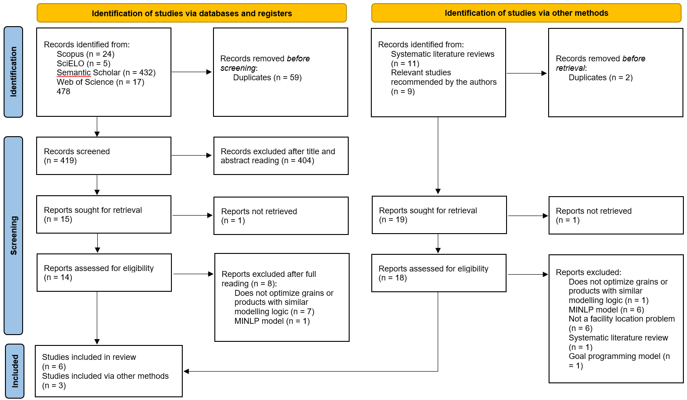

# Systematic literature review

This SLR synthesizes research on MILP models designed to optimize facility and hub location problems for grain warehouses, silos, and agricultural facilities with similar logistics. The review follows the PRISMA protocol [@page2021].

The objective is to analyze the structural formulation of these models, including assumptions, decision variables, objective functions, and constraints, to establish a benchmark for MILP location models in agriculture and facilitate model comparison. The analysis emphasizes models addressing Latin American scenarios due to regional logistical and infrastructural challenges. It evaluates both deterministic and stochastic formulations to determine how uncertainty is integrated into these frameworks.

The primary research question is: “What are the MILP models for facility and hub location problems in grain and agricultural product logistics?” Inclusion criteria required peer-reviewed journal articles or conference papers proposing deterministic or stochastic MILP formulations for agricultural supply chain nodes, with no restriction on publication year. The search string was translated into English, Spanish, and Brazilian Portuguese. The search covered Scopus, SciELO, Semantic Scholar, and Web of Science (WoS), with syntax adjusted for each platform. @tbl-search-strings details the search strings, criteria, and dates.

| Databases | Search dates | Language | Search strings |
|:---|:---|:---|:---|
| Scopus, SciELO, Semantic Scholar, Web of Science | 04-10-2026 | English | (warehouse* OR silo* OR storage OR facilit* OR hub*) AND (grain* OR soy* OR rice OR corn OR wheat OR crop* OR "agricultural commodit*") AND (locat* OR localiz* OR siting OR site OR sites OR allocat*) AND (MILP OR MIP OR ILP OR MINLP OR "mixed integer" OR "mixed-integer" OR "integer programming" OR "mathematical programming" OR "optimization model*") AND ("Latin America*" OR "South America*" OR Brazil* OR Brasil* OR Argentina OR Mexico OR Colombia OR Chile OR Peru OR Uruguay OR Paraguay) |
| | | Spanish | (almacen* OR almacén* OR silo* OR almacenamiento OR instalacion* OR instalación* OR hub*) AND (grano* OR soja OR soya OR arroz OR maiz OR maíz OR trigo OR cosecha* OR cultiv* OR "commodit* agricola*" OR "productos agricola*") AND (localizac* OR localizació* OR ubicac* OR ubicación* OR asignac* OR asignació* OR emplazamiento) AND (MILP OR MIP OR ILP OR "entera mixta" OR "mixto-entera" OR "programacion entera" OR "programación entera" OR "lineal entera") AND ("América Latina" OR Sudamérica OR Centroamérica OR Brasil OR Argentina OR México OR Colombia OR Chile OR Perú OR Uruguay OR Paraguay) |
| | | Portuguese Brazil | (armazem OR armazéns OR silo* OR armazenagem OR armazenamento OR instalac* OR instalaç* OR hub* ) AND ( grao* OR grão* OR soja OR arroz OR milho OR trigo OR safra* OR cultiv* OR "commodit* agricola*" ) AND ( localizac* OR localizaç* OR alocac* OR alocaç* OR posicionamento ) AND ( MILP OR MIP OR ILP OR "inteira mista" OR "misto-inteira" OR "programac* inteira" OR "programaç* inteira" OR "linear inteira" ) AND ( "América Latina" OR "América do Sul" OR Brasil OR Argentina OR Colômbia OR Chile OR México OR Peru OR Uruguai OR Paraguai) |

: Databases, search dates, and search strings. {#tbl-search-strings}

@fig-prisma presents the PRISMA flow diagram for new systematic reviews, which included searches of databases, registers, and other sources, mapping the selection process across the identification, screening, and inclusion phases.

{#fig-prisma}

In the database search, identification yielded 478 records, including 432 from Semantic Scholar, 24 from Scopus, 17 from Web of Science, and 5 from SciELO. The removal of 59 duplicate records left 419 records for screening. Title and abstract screening resulted in the exclusion of 404 records. Of the remaining 15 reports, 1 could not be retrieved, leaving 14 for eligibility assessment. Full text evaluation excluded 8 reports because 7 did not focus on grains or products with similar modeling logic and 1 was a mixed integer nonlinear programming (MINLP) model, resulting in 6 selected studies.

For alternative sources, identification yielded 20 records, consisting of 11 systematic literature reviews and 9 author-recommended studies. The removal of 2 duplicate records left 19 reports for retrieval, of which 1 could not be retrieved. The remaining 18 reports underwent eligibility assessment, resulting in 15 exclusions: 6 were MINLP models, 6 did not address facility location problems, 1 did not optimize grains or products with similar modeling logic, 1 was a systematic literature review, and 1 used a goal programming model, resulting in 3 selected studies.

The final review includes 9 studies, comprising 6 from the database search and 3 from alternative sources.

# Structural synthesis

## Network representation, time and uncertainty

Agricultural networks begin with farms, producing regions or procurement
centers and terminate at domestic demand, processing facilities or export
ports. Intermediate nodes may carry inventory, transfer freight or transform
products. These functions are not interchangeable. @tbl-review-networks
summarizes the nine network structures.

| Study | Origins and intermediate nodes | Destinations and operational scope |
|:--|:--|:--|
| @foulds2005 | Supply nodes and candidate grain silos | Demand nodes; dynamic network flows |
| @mascarenhas2014 | Producing microregions and warehouses | Export ports; road and road–rail connections |
| @guimaraes2017 | Production zones and logistics integration centers | Demand zones; multimodal origin–destination flows |
| @granillo2019 | Farmers and candidate barley hubs | Malt producers; optimization coupled to uncertainty simulation |
| @mogale2020 | Procurement centers, base/field silos and regional warehouses | Destination warehouses; multiple periods, transport resources and losses |
| @mendoza2021 | Sweet/industrial crop producers and facilities | Processors and distributors; yield scenarios |
| @vazquez2021 | Farms, irrigation districts and processing facilities | Bio-product customers; adoption scenarios and sustainability |
| @morais2023 | Soybean-producing cities and candidate terminals | Export allocation; road access and rail/waterway preferences |
| @milanez2026 | Producing areas and collection/transshipment hubs | Soybean export network; capacity and interhub operations |

: Network representations in the core studies. {#tbl-review-networks}

Most formulations represent a single intermediate facility layer. The
multi-echelon structure in @mogale2020 creates sequential links among
procurement, silo and warehouse stages. Several Brazilian studies aggregate
origins into producing regions, while farm-level applications retain more
granular supplier identities [@granillo2019; @vazquez2021].
Origin–destination preservation in @guimaraes2017 is distinct from the
fungible-product allocation used in the present grain-storage model.

Uncertainty is also heterogeneous. Simulation-derived uncertainty costs in
@granillo2019, crop-yield scenarios in @mendoza2021 and adoption-rate scenarios
in @vazquez2021 represent different information structures. Risk coefficients
in an objective do not necessarily define a stochastic recourse model.
Multi-period inventory likewise does not, by itself, imply multistage
uncertainty revelation.

## Parameters and physical interpretation

@tbl-review-parameters compares economic coefficients with physical
restrictions and broader impact measures. Transport costs form a common
economic core, but additional components differ substantially.

| Study | Economic inputs | Physical and broader inputs |
|:--|:--|:--|
| @foulds2005 | Silo construction and transportation | Supply, demand and silo capacity |
| @mascarenhas2014 | Road/rail freight, port charges and warehouse operations | Export production, storage sizes and port requirements |
| @guimaraes2017 | Direct/inbound/outbound freight, modal transfer and center processing | Origin–destination volumes, modal availability and center capacity bounds |
| @granillo2019 | Freight, hub opening and simulation-derived uncertainty cost | Supply, hub storage, malt demand and direct receiving limits |
| @mogale2020 | Establishment, freight, inventory, risk, emission and loss costs | Facility/vehicle capacities, fleet limits, storage and transit losses |
| @mendoza2021 | Production, freight, opening and vehicle preparation | Producer capacity, crop yields, demand, facility count and vehicle capacity |
| @vazquez2021 | Capital, harvesting, handling, processing and distribution | Irrigation, water, conversion, capacity, emissions and work-hour measures |
| @morais2023 | Terminal implementation and weighted location criteria | Distances, occupancy, permanence, harvest duration and modal preferences |
| @milanez2026 | Freight, establishment and storage | Available/demanded flow, hub sizes and route operations |

: Parameter families. {#tbl-review-parameters}

Capacity comparisons require distinguishing inventory stocks, period
throughput and vehicle loads. Terminal occupancy and grain permanence in
@morais2023 convert seasonal allocation into capacity requirements.
Inventory and loss parameters in @mogale2020 address a different operational
mechanism. Treating either as an unqualified “warehouse capacity” can obscure
the physical meaning of a constraint.

Public agricultural statistics, freight systems, mapping services and
private field observations support the reviewed case studies. Their
geographic detail, price basis and handling assumptions limit direct numerical
transfer. Emission coefficients, work-hour benefits and loss fractions appear
only where the corresponding impacts are explicitly modeled.

## Investment and operating decisions

@tbl-review-variables distinguishes location decisions from continuous
operation and genuine resource-count decisions.

| Study | Discrete decisions | Continuous decisions |
|:--|:--|:--|
| @foulds2005 | Silo construction | Shipments and silo capacity |
| @mascarenhas2014 | Warehouse installation at a selected size | Road/intermodal shipments and port arrivals |
| @guimaraes2017 | Integration-center opening | Direct and center-mediated flows with origin–destination identity |
| @granillo2019 | Hub opening and uncertainty-cost selection | Farmer–hub–malt shipment quantities |
| @mogale2020 | Silo/assignment activation and numbers of vehicles or rakes | Shipment, inventory and loss quantities |
| @mendoza2021 | Facility opening and distributor/processor assignments | Scenario-dependent crop flows |
| @vazquez2021 | Processing-facility installation | Facility capacity and scenario-dependent biomass/bio-product flows |
| @morais2023 | City–terminal assignment and terminal type | No separate continuous-flow family in the reported assignment formulation |
| @milanez2026 | Hub opening at a capacity level | Collection, interhub, distribution and storage flows |

: Decision-variable families. {#tbl-review-variables}

Binary investment decisions commonly activate continuous operating
quantities. Integer transport counts in @mogale2020 additionally represent
indivisible resources. The number of locations in an instance is not an
integer decision unless selected by the optimization. Scalable investment
quantities also differ from selecting one predefined capacity level.

## Objectives and decision criteria

@tbl-review-objectives compares objective boundaries rather than assuming
that every cost minimum measures the same economic outcome.

| Study | Principal criterion | Additional components or preferences |
|:--|:--|:--|
| @foulds2005 | Construction and transport cost | Dynamic allocation |
| @mascarenhas2014 | Freight, port and warehouse-operation cost | Export-chain accounting |
| @guimaraes2017 | Transport, transfer and processing cost | Multimodal integration |
| @granillo2019 | Freight and hub-opening cost | Simulation-derived uncertainty impact |
| @mogale2020 | Integrated network cost | Inventory, risk, losses and emission cost |
| @mendoza2021 | Expected production and logistics cost | Yield probabilities and vehicle preparation |
| @vazquez2021 | Economic, environmental and social objectives | Emissions reduction and workforce benefits |
| @morais2023 | Weighted terminal-location criteria | Modal preference and road-distance/emission proxy |
| @milanez2026 | Collection, transfer, distribution, holding and establishment cost | Hub economies and additional operating costs |

: Objective-function scope. {#tbl-review-objectives}

Most studies minimize an economic aggregate. Sustainability enters through
costs, weighted preferences, explicit bounds or separate objectives, each
with different interpretation. The multiobjective formulation of
@vazquez2021 explicitly considers emissions and social benefits.
Shorter routes or a numerical capacity relaxation cannot substitute for
such impact accounting.

## Constraints and feasibility

@tbl-review-constraints summarizes the mechanisms that connect facility
choices to feasible logistics.

| Study | Material and demand restrictions | Activation and distinctive restrictions |
|:--|:--|:--|
| @foulds2005 | Supply, demand and silo flow balance | Construction–capacity linking |
| @mascarenhas2014 | Supply, port requirements and warehouse transfer balance | Installed-size capacity; no intermediate stock accumulation |
| @guimaraes2017 | Exact origin–destination demand and center conservation | Opening-dependent capacity bounds; preservation of shipment identity |
| @granillo2019 | Hub balance, supply/demand and direct receiving capacity | Flow restricted to open hubs; simulation-related objective restriction |
| @mogale2020 | Interperiod inventory with losses, demand and fleet capacities | Facility/assignment linking; vehicle counts and size selection |
| @mendoza2021 | Yield-dependent supply and assigned customer quantities | Opening/assignment logic and facility-count limit |
| @vazquez2021 | Biomass conversion, demand, water and facility capacity | Facility activation; environmental/social bounds |
| @morais2023 | Total export allocation and seasonally adjusted terminal capacity | Distance limit, terminal type and installation-dependent assignment |
| @milanez2026 | Inventory, demand and hub flows | Capacity-level opening and penalized port-capacity exceedance |

: Constraint families. {#tbl-review-constraints}

Intermediate flow balance is not always an inventory equation:
transfer facilities can require zero accumulation, whereas storage networks
link periods through carried stock. Conversion and loss terms further change
the conservation system. Assignment models can impose exclusive city–terminal
relationships rather than continuous product routing. Logical linking is
essential to prevent operation through facilities that have not been
installed.

The comparison supports three requirements for the present framework:
explicit stock-versus-throughput units, declared uncertainty information
structure and independent checks of every indexed balance and activation
restriction. These requirements connect modeling interpretation to
computational validation; they do not establish performance superiority
over the reviewed studies.

# Complementary literature and synthesis limitations

Harvest and production planning reviews identify the importance of uncertainty
and perishability [@taskiner2021], while grain-location reviews emphasize
disruption and sustainability gaps [@rosa2025]. Silo-location planning in
@steiner2017, social sustainability in @mogale2023, disruption-aware intermodal
transport in @maiyar2019 and integrated crop/harvest planning in @anselmino2025
extend the application context beyond the core sample.

The synthesis emphasizes structural comparability. It does not pool optimal
costs, infer a common runtime benchmark or independently reconstruct each
published implementation. The unresolved search chronology, alternative-source
counts and absent screening exports must be reconciled before the selection
record is represented as fully reproducible. The supplied studies and their
substantive distinctions remain explicit in the tables.

# Declaration of generative AI and AI-assisted technologies {-}

ChatGPT Codex assisted with restructuring, language refinement and conversion
of the literature-review material into editable Quarto tables. The authors
are responsible for verifying the study extraction, selection record and
final scholarly interpretation.

# References

::: {#refs}
:::
